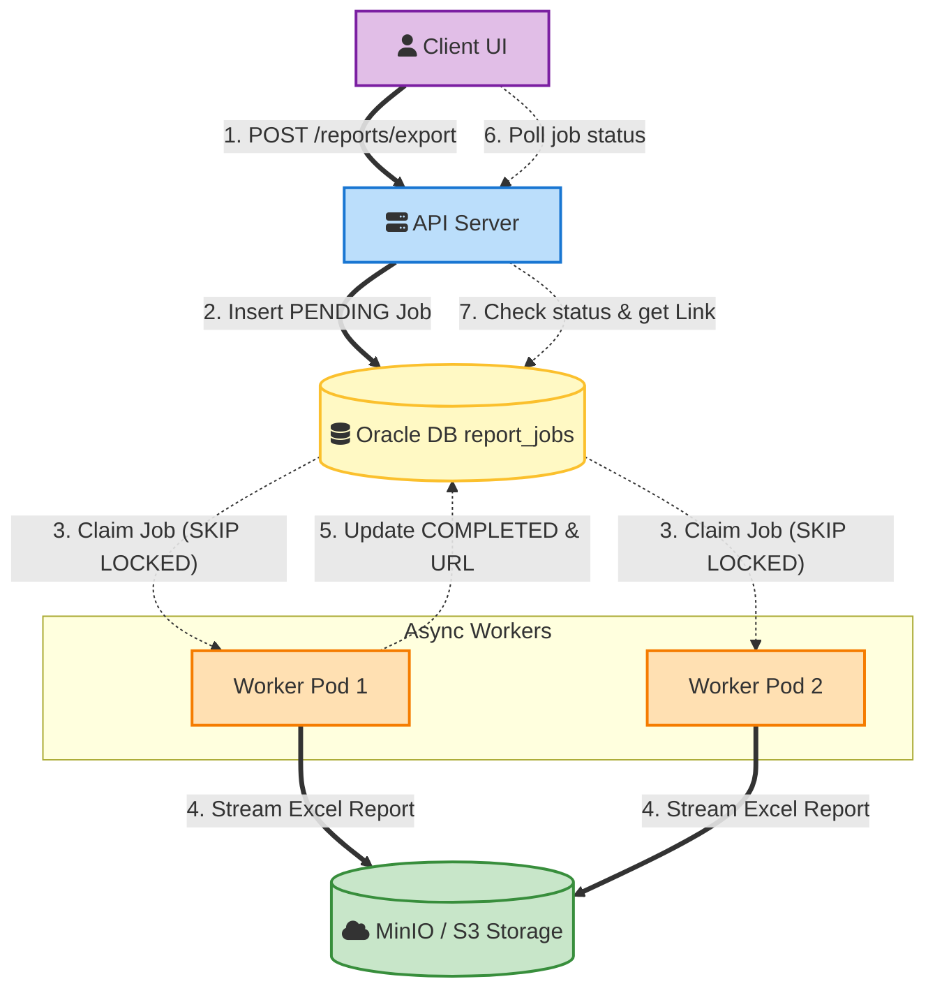

# Asynchronous Report Generation Daemon

This document provides an end-to-end understanding of the Asynchronous Report Generation project, tailored specifically for an SDE-2 interview depth. It covers systemic validation, architectural and structural designs, edge-case mitigation strategies, and realistic interview cross-questions to help you confidently articulate your engineering decisions.

## Table of Contents
* [STAR & Project Context](#star--project-context)
* [End-to-End System Architecture](#end-to-end-system-architecture)
* [HLD (High-Level Design)](#hld-high-level-design)
* [Deep Dive (Resilience & Scale)](#deep-dive-resilience--scale)
* [Testing & Validation](#testing--validation)
* [Question Bank & Strategies](#question-bank--strategies)

## STAR & Project Context

* **What is Asynchronous Report Generation Daemon:** A decoupled, background processing system that shifts heavy data-export workloads from user-facing web servers to dedicated background workers, using a database-backed queue.
* **Situation:** We had recently shipped report generation functionality. While generating reports Users faced request timeouts for certain requests. On further analysing the code I noticed that it was a synchronous processing (using Apache POI `XSSFWorkbook`) which for huge files caused request time out and CPU spikes and exhausted JVM heap limits, leading to frequent Out of Memory (OOM) crashes on our main web pods.
* **Task:** The goal was to completely decouple the memory-intensive report generation process from main pods to eliminate any issues. 
* **Action:** I built a DB-as-Queue polling system. When User makes an API call instead of synchronous processing user gets a 202 status and in a Jobs table entry gets created. Along with this you have standalone Java daemon workers it pick up jobs and do computation in the background, utilized database-level row locking (`SKIP LOCKED`) for concurrency control, and implemented disk-backed streaming for low-memory Excel generation.
* **Result:** The new architecture successfully eliminated OOM-related pod failures by 95%, stabilized the user-facing web platform, and provided a highly resilient, scalable way to generate massive reports without dropping requests.
* **Why we did it (Motivation & Trade-offs):** We chose a Database-as-a-Queue pattern to prioritize system simplicity and transactional integrity. Introducing a dedicated message broker (like Kafka) would have required new infrastructure overhead. We traded slight polling latency and minor DB load for immediate architectural stability and reduced operational complexity.
* **What else we could have done (Alternatives):** We strongly considered a dedicated message queue (Kafka/RabbitMQ). While an MQ would offer lower latency and better scaling for high-throughput, it was discarded because our throughput requirements were moderate (a few seconds of delay was perfectly acceptable), and we wanted to avoid the operational overhead of managing new infrastructure.

## End-to-End System Architecture

### Phase 1: Trigger & Job Enqueue
* **Event/Trigger:** A user clicks "Export" on the frontend UI, sending a `POST /reports/export` request to the API server.
* **Action/Mechanism:** The API synchronously inserts a new record into the `report_jobs` table with a status of `PENDING` (capturing filters, user info, etc.) and immediately returns a `job_id` to the client.
* **Benefit/Result:** The user is instantly freed from waiting for the report to generate, preventing HTTP timeouts and freeing up web-server threads immediately.

### Phase 2: Job Claiming (Integration)
* **Event/Trigger:** A scheduled cron thread in the worker daemon fires every  seconds.
* **Action/Mechanism:** Workers query the database for `PENDING` jobs using a `SELECT ... FOR UPDATE SKIP LOCKED` query, updating the claimed rows to `PROCESSING`.
* **Benefit/Result:** Multiple worker pods can operate concurrently without stepping on each other's toes or causing database deadlock, naturally load-balancing the queue.

### Phase 3: Execution & Report Generation
* **Event/Trigger:** The worker successfully locks and claims a job.
* **Action/Mechanism:** The worker fetches data using JDBC cursor-based streaming (chunking) and writes the data to an Excel file using Apache POI `SXSSFWorkbook` (flushing rows to a temporary disk file rather than holding them in memory).
* **Benefit/Result:** Memory usage (RSS) remains completely flat (e.g., under 512MB) regardless of whether the report has 1,000 or 500,000 rows, permanently solving the OOM issue.

### Phase 4: Storage & Completion
* **Event/Trigger:** The Excel file generation completes on the local worker disk.
* **Action/Mechanism:** The file is streamed to MinIO/S3 object storage. The database record is then updated to `COMPLETED` alongside the newly generated `s3_url`.
* **Benefit/Result:** The file is securely stored in a scalable object store, and the state change allows the client to retrieve the download link.

### Phase 5: Fallback & Recovery
* **Event/Trigger:** A worker pod crashes mid-generation (e.g., node failure) leaving a job indefinitely in the `PROCESSING` state.
* **Action/Mechanism:** A scheduled "Reaper" task scans the DB for jobs stuck in `PROCESSING` where the `heartbeat_at` timestamp is older than 5 minutes. It resets these jobs back to `PENDING` and increments a `retry_count`.
* **Benefit/Result:** Ensures system fault tolerance. No report request is ever "lost" due to a transient infrastructure failure, and poison-pill jobs are eventually marked as `DEAD_LETTER` to prevent infinite loops.

## HLD (High-Level Design)

## Deep Dive (Resilience & Scale)

### Concurrency Control with Database Locks
Using a database as a queue often introduces severe race conditions when multiple consumers poll simultaneously. To mitigate this, `SELECT ... FOR UPDATE SKIP LOCKED` was implemented. Unlike optimistic locking (which wastes CPU on version collisions and rollbacks) or standard pessimistic locking (which causes thread starvation by blocking other readers), `SKIP LOCKED` allows concurrent threads to glide past already-locked rows and fetch the next available jobs instantaneously.

### Memory Management via Stream Processing
The core OOM issue was solved by applying a strict "Streaming" paradigm top-to-bottom. First, JDBC streaming fetches database records in small chunks (e.g., 1,000 rows at a time). Second, Apache POI's `SXSSFWorkbook` maintains a fixed sliding window of rows (e.g., 100) in the JVM heap, pushing older rows to a temporary XML file on the disk. This strictly bounds memory allocation, turning an O(N) memory complexity into O(1).

### Fault Tolerance & State Recovery (Heartbeats)
In distributed systems, a worker node can disappear silently. To handle this, the system implements an active heartbeat mechanism. Worker threads asynchronously update a `heartbeat_at` timestamp on their active job row every 30 seconds. A decentralized "Reaper" daemon monitors the table for stale jobs (e.g., `heartbeat_at < NOW() - 5 min`) and safely rolls them back to `PENDING`. 

### Event-Driven Autoscaling (KEDA)
To optimize resource usage, worker pods dynamically scale. Using Kubernetes Event-driven Autoscaling (KEDA), the infrastructure actively polls the database for `SELECT COUNT(*) FROM report_jobs WHERE status = 'PENDING'`. The Kubernetes HPA is configured to map this metric to pod replicas. During idle periods, the cluster scales down to 1 pod; during report spikes, it dynamically provisions workers up to a defined maximum, effectively minimizing idle cloud costs.

## Testing & Validation 

1. **Unit & Integration Testing:** We isolated internal logic using standard JUnit tests. For integration, we utilized `Testcontainers` to spin up a real Oracle/Postgres DB instance to mathematically verify the `SKIP LOCKED` behavior, and `WireMock` to stub out our MinIO/S3 storage endpoints.
2. **Resilience Testing:** We performed chaos engineering by manually killing worker pods (`kubectl delete pod`) mid-report-generation. We verified that the heartbeat stopped and our Reaper scheduled task correctly recovered the orphaned job and reassigned it to a healthy pod.
3. **Concurrency Testing:** We aggressively spawned 50 parallel threads attempting to claim jobs simultaneously against the DB. We validated through logs and database assertions that no two threads ever claimed the same `job_id`, proving our database locking mechanism was completely race-condition-free.

## Question Bank & Strategies

### 0. "How large of document is supported by this system & why? "
* This system handles reports up to 1 million rows, producing Excel files around 100 to 300 MB. Memory usage stays low and constant because we stream the data, but 1 million rows is our hard limit. That's mainly due to Excel's row cap, the worker pod's temporary disk space during generation, and avoiding long-running database connections

### 1. "Why did you use SKIP LOCKED instead of standard optimistic locking or basic SELECT FOR UPDATE?"
* **Strategy:** The interviewer wants to ensure you understand DB locking mechanisms and their performance trade-offs at a deep level.
* **Sample Answer:** "If I used standard `SELECT FOR UPDATE`, it would block other worker threads from reading the table, causing database lock timeouts and severe thread starvation. I considered optimistic locking, but it requires workers to attempt an update and roll back upon a version collision, which wastes CPU cycles under high contention. `SKIP LOCKED` was the perfect middle ground—it lets workers smoothly slide over already-claimed jobs and lock the next available batch without waiting, maximizing our concurrent throughput."

### 2. "How did you resolve the Out-Of-Memory (OOM) issue inside the daemon itself? Moving it just shifts the problem."
* **Strategy:** They want to see if you understand JVM heap mechanics and stream processing instead of just shifting infrastructure.
* **Sample Answer:** "You're absolutely right; just moving the process would have just crashed the daemon pods instead. I solved the actual memory bloat in two ways. First, I implemented Database Cursor Streaming, fetching data in chunks of 1,000 rather than loading millions of rows at once. Second, I swapped our Excel library to Apache POI `SXSSF`, which flushes data to a disk-backed temporary file instead of holding the XML structure in RAM. This decoupled our memory usage from the dataset size, keeping our resident memory strictly under 512MB regardless of the report size."

### 3. "What happens if the daemon pod crashes midway through generating a report? How do you prevent jobs from getting stuck forever?"
* **Strategy:** The interviewer is looking for your understanding of fault tolerance, idempotency, and distributed system recovery.
* **Sample Answer:** "I anticipated pod crashes, so I built a stale-job recovery mechanism using heartbeats. While a pod processes a job, it updates a `heartbeat_at` timestamp every 30 seconds. If a pod dies, that heartbeat stops. I set up a background Reaper task that looks for jobs in the `PROCESSING` state with a heartbeat older than 5 minutes. It resets those jobs to `PENDING` and increments a retry counter. If a job breaches the max retries, it is moved to a `DEAD_LETTER` state so it doesn't infinitely poison the queue."

### 4. "How did you decide the number of workers? Isn't it a waste of resources to have many workers sitting idle most of the time?"
* **Strategy:** Demonstrates your awareness of cloud costs, dynamic orchestration, and Kubernetes scaling mechanics.
* **Sample Answer:** "I wanted to avoid static provisioning because it wastes compute. Instead, I used dynamic scaling driven by queue depth. I configured KEDA (Kubernetes Event-driven Autoscaling) to periodically run a `COUNT(*)` query on the `PENDING` jobs in our database. KEDA feeds this metric to our Horizontal Pod Autoscaler. When the queue is empty, we scale down to just 1 idle pod. When a burst of reports comes in, Kubernetes automatically spins up workers proportional to the queue size, and terminates them once the backlog is cleared."

### 5. "As your system scales, your `report_jobs` table will grow massive. Won't this eventually slow down your polling queries?"
* **Strategy:** Checking your foresight into database optimization, indexing strategies, and data lifecycle management.
* **Sample Answer:** "Yes, a constantly growing table would cause full table scans and degrade polling performance. To prevent this, I ensured we had a composite index on `(status, created_at)` so the `PENDING` query lookup is instant. Furthermore, a DB-as-Queue should only hold active data. I implemented a daily archival job that sweeps `COMPLETED` and `FAILED` records older than 7 days into a cold-storage historical table. This guarantees our active `report_jobs` table remains small, keeping the B-tree index shallow and our polling queries lightning fast."
