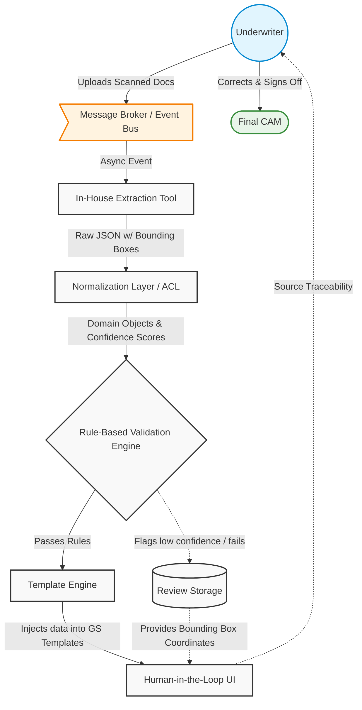

# CAM Memo Automation (PB Doc AI)

This document provides an end-to-end understanding of the CAM Memo Automation project, tailored for an SDE-2 depth. It covers the systemic validation of probabilistic AI models, structural distributed system designs, edge-case mitigation, and anticipated interview cross-questions to help you confidently articulate your architectural decisions.

## Table of Contents
* [STAR & Project Context](#star--project-context)
* [End-to-End System Architecture](#end-to-end-system-architecture)
* [HLD (High-Level Design)](#hld-high-level-design)
* [Deep Dive (Resilience & Scale)](#deep-dive-resilience--scale)
* [Testing & Validation](#testing--validation)
* [Question Bank & Strategies](#question-bank--strategies)

## STAR & Project Context
*   **What is CAM Memo Automation:** An automation pipeline for generating Credit Approval Memorandums (CAMs), which are foundational internal documents prepared by underwriters to evaluate borrower creditworthiness and risks.
*   **Situation:** CAM generation was a highly manual, time-consuming bottleneck. Underwriters had to manually set up file templates, read through dense, unstructured financial documents, and extract/format content to strict GS standards.
*   **Task:** The goal was to automate the generation of credit approval memo document with a human in loop.
*   **Action:** I designed an architecture that integrated an in house document extraction tool pb doc ai alongside a template engine to generate the draft of cam Memo. To mitigate AI hallucinations, I implemented strict confidence score thresholds, deterministic rule-based accounting validations, and a Human-in-the-Loop (HITL) UI with source traceability.
*   **Result:** Reduced underwriting effort from weeks to hours per document. The system successfully transforms unstructured financial data into highly structured, compliant CAMs while completely eliminating manual template setup.
*   **Why we did it (Motivation & Trade-offs):** Automating the first draft massively boosts throughput and consistency. However, because financial decisions carry high risk, the core trade-off was accepting that we could not fully automate the process; we had to build heavy engineering guardrails around the AI and keep underwriters in the loop for final sign-off to respect regulatory expectations.
*   **What else we could have done (Alternatives):** 
    *   *Pure Rule-Based Templating:* We considered skipping AI entirely and using pure rule-based OCR templating. This was discarded because it fails on highly unstructured, varied document formats.
    *   *Multi-Agentic LLM Model:* We explored using multiple AI agents working in sync to debate and verify data. This was discarded for the initial release due to excessive latency, high architectural complexity, and lack of deterministic debugging.

## End-to-End System Architecture

### 1. Ingestion & Trigger Phase
*   **Event/Trigger:** An underwriter uploads a scanned financial document via the UI.
*   **Action/Mechanism:** The upload is persisted to secure storage, and an asynchronous event is pushed to a message broker (e.g., Kafka/RabbitMQ). A background worker picks up the event.
*   **Benefit/Result:** Decouples heavy file processing from the web layer, preventing HTTP timeouts, ensuring high availability, and allowing the system to scale horizontally during peak upload times.

### 2. Extraction & Anti-Corruption Layer (ACL)
*   **Event/Trigger:** The background worker calls the in-house extraction tool.
*   **Action/Mechanism:** The tool returns a deeply nested raw JSON with bounding boxes and confidence scores. The ACL parses, sanitizes (e.g., type coercion from `"1,000.50"` to `1000.50`), and maps this payload into strict, internal Domain Objects.
*   **Benefit/Result:** Isolates core underwriting logic from the unpredictability of ML models. If the extraction tool's JSON schema changes, only the ACL needs updating, protecting downstream services.

### 3. Rule-Based Validation Engine
*   **Event/Trigger:** Domain Objects are passed from the ACL to the Validation Engine.
*   **Action/Mechanism:** Deterministic accounting rules are applied (e.g., `Total Assets == Total Liabilities + Equity`). The system also checks if extraction confidence falls below a strict threshold. If a check fails, the field is marked `is_flagged = True`.
*   **Benefit/Result:** Protects the business from AI hallucinations by forcing probabilistic data to pass deterministic software engineering constraints before it reaches a financial document.

### 4. Template Engine Assembly
*   **Event/Trigger:** Validated Domain Objects are pushed to the rendering service.
*   **Action/Mechanism:** A templating engine maps the objects to strict GS-standard layouts using placeholders (e.g., `{{financials.ebitda}}`). Missing or flagged data triggers a visual warning banner rather than failing the build.
*   **Benefit/Result:** Separates presentation logic from business logic. Business teams can update CAM layouts without touching the complex extraction backend.

### 5. Human-in-the-Loop (HITL) Finalization
*   **Event/Trigger:** The generated draft is rendered in the UI for the underwriter.
*   **Action/Mechanism:** The UI displays the draft with flagged fields highlighted. Using stored coordinates `[x1, y1, x2, y2]`, clicking a flag overlays the exact source text on the original scanned document for visual verification.
*   **Benefit/Result:** Maximizes trust and drastically reduces review time. The underwriter can instantly trace data provenance, correct errors, and sign off confidently.

## HLD (High-Level Design)

## Deep Dive (Resilience & Scale)

### Asynchronous Decoupling & Circuit Breaking
To handle large, heavy scanned documents, the ingestion pipeline relies on an event-driven architecture. By placing uploads onto a message queue, worker nodes can process documents at their own pace. If the in-house extraction tool experiences latency or downtime, the system employs a **circuit breaker** pattern. Instead of dropping requests, the system fails-closed at the external boundary, queuing messages for later retry with exponential backoff, ensuring zero data loss.

### Deterministic Guarding of Probabilistic Systems
AI models are probabilistic; financial regulations demand determinism. To bridge this gap, the Validation Engine acts as a strict gateway. Rather than failing the entire pipeline if a single value hallucinates, the system implements granular, field-level fault tolerance. By using strict accounting equations (Assets = Liabilities + Equity), it gracefully degrades by flagging specific anomalies for the HITL UI, preserving the valid 95% of the extraction work.

### Idempotency in Distributed Events
Because the extraction process is asynchronous, network drops can cause message broker retries, leading to duplicate document processing. The system handles this via idempotency keys generated at upload (e.g., a hash of the document and timestamp). The database checks this key before inserting extracted domain objects; if a duplicate event is consumed, the system acknowledges the message without recreating the CAM draft.

### Concurrency Control in HITL Editing
When underwriters review the generated CAM in the UI, there is a risk of concurrent edits if multiple reviewers access the same draft. The system uses **optimistic locking** via a version number on the draft record. If Reviewer A and Reviewer B open the draft, and Reviewer A saves a correction, the version increments. When Reviewer B attempts to save, the system detects a version mismatch and prompts them to refresh, preventing lost updates.

## Testing & Validation 

1. **Unit & Integration Testing:** We isolated our core logic from the external AI tool by utilizing `WireMock` to simulate the extraction API. We fed various mocked JSON schemas (both clean and malformed) into our Anti-Corruption Layer to assert that type coercion, data sanitization, and fallback logic behaved exactly as expected.
2. **Resilience Testing:** To validate our asynchronous workers, we simulated upstream failures like HTTP 500 errors and extreme latency spikes from the in-house extraction tool. We monitored the message broker to ensure circuit breakers tripped correctly, retries utilized exponential backoff, and no dead-letter queue (DLQ) drops occurred under stress.
3. **Concurrency Testing:** We wrote multi-threaded test scripts to simulate simultaneous updates to the same draft CAM. This validated our optimistic locking mechanisms, proving that concurrent writes resulted in a graceful `409 Conflict` error rather than overwriting critical financial data.

## Question Bank & Strategies

**Q1: How do you handle AI hallucinations or extraction errors in critical financial pipelines?**
*   **Strategy:** The interviewer wants to see that you do not blindly trust AI and understand how to build software guardrails around probabilistic outputs.
*   **Sample Answer:** "I knew I couldn't trust AI extraction blindly for something as foundational as a CAM. To mitigate this, I built a multi-layered defense. First, I implemented confidence score thresholds; anything scoring low is immediately flagged. Second, I introduced a deterministic rule-based engine that validates accounting principles, like ensuring Total Assets equal Liabilities plus Equity. Finally, instead of failing the whole pipeline on an error, I built source traceability, allowing underwriters to click a flagged field and instantly see the original bounding box in the source document to make a fast correction."

**Q2: ML models evolve frequently. How does your system handle changes to the JSON output format from the extraction tool?**
*   **Strategy:** Demonstrate your knowledge of decoupling upstream dependencies using the Anti-Corruption Layer (ACL) pattern.
*   **Sample Answer:** "I anticipated that the ML team would iterate on their models, so I implemented an Anti-Corruption Layer (ACL) directly after ingestion. This layer strictly maps the raw, unpredictable JSON from the AI tool into strongly-typed internal Domain Objects. When the ML team updates their schema, I only have to update the mapping logic inside the ACL. The rest of the system—the validation engine, template rendering, and database—remains completely untouched and stable."

**Q3: How does this pipeline scale to handle a large volume of heavy scanned documents without timing out?**
*   **Strategy:** Focus on event-driven architecture, asynchronous processing, and decoupling the UI from heavy backend tasks.
*   **Sample Answer:** "Processing heavy PDFs synchronously would lead to HTTP timeouts and poor user experience. I decoupled ingestion from processing by moving to an event-driven architecture. When an underwriter uploads a document, it's saved to storage, and a message is pushed to a broker. A pool of asynchronous worker nodes consumes these messages and orchestrates the extraction and validation in the background. Once the draft is ready, the UI is notified via webhooks/polling, freeing up immediate web server resources and allowing us to scale workers horizontally based on queue depth."

**Q4: How do you handle missing data if the extraction tool completely misses a critical section of the document?**
*   **Strategy:** Explain how you handle null values gracefully in the presentation layer without crashing the application.
*   **Sample Answer:** "I used safe navigation operators and strict fallback values within the Template Engine. If the domain objects arrive missing a critical block, the backend marks the CAM's overall state as 'incomplete'. The template engine is designed to not fail on missing properties; instead, it renders a visual warning banner in that specific section of the UI, prompting the underwriter that manual data entry is required, while safely rendering the rest of the valid data."

**Q5: What happens if an underwriter corrects a flagged value in the UI, but the network drops before the save completes?**
*   **Strategy:** The interviewer is looking for idempotency, retry mechanisms, and state management on the client and server side.
*   **Sample Answer:** "To ensure no work is lost, the UI locally caches the edits. When the save is triggered, the payload includes an idempotency key and a version hash. If the network drops, the UI automatically retries the request with the same key. On the backend, we check the version and idempotency key before applying the update. If the database already has the updated state from a partial connection, we simply return a 200 OK. If not, the transaction processes safely without causing race conditions or duplicate data entries."
