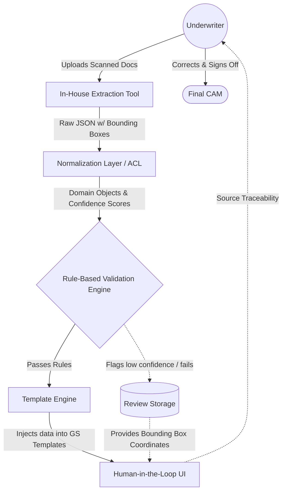

# Deep Dive: CAM Memo Automation (PB Doc AI)

## Table of Contents
1. [Project Overview & Impact](#project-overview--impact)
2. [Architecture Diagram](#architecture-diagram)
3. [End-to-End System Architecture](#end-to-end-system-architecture)
4. [Data Flow Deep Dive](#data-flow-deep-dive)
5. [SDE-2 Interview: Technical Cross-Questions & Strategies](#sde-2-interview-technical-cross-questions--strategies)
    - [Handling AI Hallucinations & Data Integrity](#handling-ai-hallucinations--data-integrity)
    - [Schema Evolution & Anti-Corruption Layer (ACL)](#schema-evolution--anti-corruption-layer-acl)
    - [System Scalability & Performance](#system-scalability--performance)
    - [Template Engine & Rendering Logic](#template-engine--rendering-logic)
    - [Human-in-the-Loop & Traceability](#human-in-the-loop--traceability)
6. [Summary for Interview Preparation](#summary-for-interview-preparation)

---

## Project Overview & Impact
**What is CAM:** Credit Approval Memorandum is an internal document prepared by underwriters to evaluate a borrower’s creditworthiness. It serves as the foundation for all lending decisions and credit risks.

**Situation:** CAM generation is a time consuming process because the underwriters have to manually set up the file template, go through the financial documents and add content as per the GS standards. 

**Task:** Automate the manual time-consuming process of drafting Credit Approval Memorandums (CAMs) for underwriters.

**Action:** I built a pipeline that used in house tools to extract financial data from scanned documents and auto-generate draft via a template engine. To handle AI errors, I implemented confidence thresholds, rule-based accounting validations, and source traceability for human review.

**Result:** This Reduced underwriting effort from weeks to hours by building a pipeline that transforms unstructured financial documents into structured, template-driven CAMs.

---

# CAM Automation Architecture and Interview Prep

## Architecture Diagram

### Core Components Illustrated:
*   **Underwriter (Actor):** Initiates the flow by uploading scanned financial documents.
*   **In-House Extraction Tool:** Performs OCR and extracts financial data points and bounding boxes.
*   **Normalization Layer (ACL):** Converts the raw extracted JSON into domain objects.
*   **Validation Engine:** Enforces rule-based accounting validations (e.g., Assets = Liabilities + Equity) to catch AI errors.
*   **Template Engine:** Injects normalized objects into pre-set file templates configured to GS standards.
*   **Review Storage / Cache:** Stores flagged fields based on confidence thresholds for human review.
*   **Human-in-the-Loop:** Final underwriter review utilizing source traceability for fast sign-off.

---

## End-to-End System Architecture

I built this architecture around a decoupled, pipeline-based approach to ensure that the unpredictability of AI data extraction is heavily guarded by deterministic software engineering practices.

### 1. Ingestion & Data Extraction
*   **Mechanism:** Underwriters upload unstructured, scanned financial documents. 
*   **Processing:** Our in-house extraction tools process the documents to extract raw text, numerical values, and structural tables.
*   **Output:** A deeply nested JSON payload containing extracted financial data, bounding box coordinates, and confidence scores.

### 2. Normalization Layer & Anti-Corruption Layer (ACL)
*   **Mechanism:** A mapping layer that acts as an Anti-Corruption Layer (ACL).
*   **Role:** It isolates the core underwriting logic from the raw output of our in-house extraction tools. It parses the raw JSON and converts it into type-safe, internal domain objects.
*   **Data Enrichment:** Each extracted value retains its associated confidence score and bounding box coordinates within the domain object.

### 3. Rule-Based Validation Engine
*   **Mechanism:** Deterministic business logic layered over the probabilistic AI output.
*   **Role:** Enforces strict accounting principles to trap AI errors. I implemented rules to programmatically verify relationships, such as ensuring `Total Assets` matches `Total Liabilities + Equity`.
*   **Handling Failures:** If a validation fails, or if confidence scores drop below a strict threshold, the pipeline flags the specific field rather than discarding the entire document.

### 4. Template Engine
*   **Mechanism:** Uses a templating language to automate the manual setup of CAM files.
*   **Role:** Normalized, validated domain objects are injected into a template library designed strictly around GS standards. Placeholders (e.g., `{{financials.ebitda}}`) are populated dynamically.
*   **Output:** A highly structured, auto-generated draft of the Credit Approval Memorandum.

### 5. Human-in-the-Loop (HITL) & Source Traceability
*   **Mechanism:** The generated draft is presented to the underwriter in a UI.
*   **Role:** Any field flagged due to low confidence thresholds or failed rule-based validations is visually highlighted.
*   **Traceability:** I implemented source traceability where underwriters click on a flagged value, and the UI uses the stored bounding box coordinates to overlay the exact source text on the original scanned document, allowing for instant human verification.

---

## Data Flow Deep Dive

1. **Upload:** Underwriter uploads scanned financial documents.
2. **Extraction:** Backend pipeline sends the document to the in-house extraction tool, which returns the extraction payload.
3. **Normalization:** The ACL maps the raw extraction payload into the internal Domain Model.
4. **Validation Check:**
   *   Check 1: `confidence > threshold` -> Pass.
   *   Check 2: `Assets == Liab + Equity` -> Pass.
   *   If Fail: Mark field `is_flagged = True`.
5. **Template Rendering:** The Domain Model is passed to the Template Engine to generate the draft according to GS standards.
6. **Review:** UI renders the draft. The underwriter clicks a flagged field, and the UI fetches the original document, drawing a box using the traced coordinates `[x1, y1, x2, y2]`.
7. **Finalization:** The underwriter corrects any flagged values, saves, and the final CAM is generated.

---

## SDE-2 Interview: Technical Cross-Questions & Strategies

### Handling AI Errors & Data Integrity

**Q: How do you handle AI hallucinations or extraction errors in critical financial pipelines?**
*   **Answer:** I knew I couldn't trust the AI extraction blindly for something as foundational as a CAM. I built a two-pronged defense mechanism to handle AI errors:
    1.  **Confidence Score Thresholds:** Any field returned with a confidence score below our defined threshold is explicitly flagged for human review.
    2.  **Rule-Based Accounting Validations:** I implemented strict deterministic constraints. For instance, the system validates that `Assets = Liabilities + Equity`. If the extraction breaks this fundamental rule, the validation engine catches it immediately.
    3.  **Source Traceability:** To make reviewing these flagged errors efficient, I built source traceability. Underwriters can click any extracted value, and the UI highlights the original bounding box on the scanned document.

**Q: What happens if the extraction tool returns a value as a string (e.g., "1,000.50") but your system expects a float?**
*   **Answer:** The Normalization layer handles data sanitization and type coercion. Before mapping to our domain objects, custom validators strip commas, currency symbols, and handle accounting edge cases (like `(100)` meaning `-100`). If coercion fails entirely, the field defaults to a null state and is flagged for Human-in-the-Loop review.

### Schema Evolution & Anti-Corruption Layer (ACL)

**Q: Even with in-house tools, extraction models get updated. How does your system handle changes to the JSON output format?**
*   **Answer:** I utilized the Anti-Corruption Layer (ACL) pattern. The normalization layer strictly isolates our core pipeline logic from the in-house extraction tool's API contract. If the ML team updates the model and the JSON schema changes, the validation engine, template engine, and domain objects remain completely untouched. I only need to update the specific mapping logic within the ACL.

### System Scalability & Performance

**Q: How does this pipeline scale to handle a large volume of heavy scanned documents?**
*   **Answer:** I decoupled the ingestion from the processing using an event-driven architecture. 
    1.  The underwriter uploads a document, which is stored securely.
    2.  An event is placed on a message broker.
    3.  A pool of asynchronous worker nodes consumes these messages, triggers the in-house extraction tool, and runs the normalization and validation logic in the background.
    4.  The underwriter is notified once the draft CAM is ready for review, preventing HTTP timeouts and freeing up server resources.

### Template Engine & Rendering Logic

**Q: Why use a template engine instead of hardcoding the document generation logic?**
*   **Answer:** Underwriters have to format these documents strictly to GS standards, which can evolve. Using a template engine separates the presentation layer from the business logic. If the business team needs to update the CAM layout to meet a new standard, we can modify the template independently without touching the complex extraction and validation backend. 

**Q: How do you handle missing data in the templates if the extraction tool completely missed a section?**
*   **Answer:** I used safe navigation operators and fallback values in the template engine. If a critical block is missing, the backend flags the CAM as incomplete, and the template renders a warning banner for the underwriter indicating that manual data entry is required for that specific section.

---

## Summary for Interview Preparation

When discussing this project, focus on the engineering maturity and the massive business impact:
1.  **You solved a massive bottleneck:** You reduced underwriting effort from *weeks to hours* by transforming unstructured data into structured, ready-to-review drafts.
2.  **You built defensive engineering:** You didn't just assume the AI would work; you built confidence thresholds, rule-based validations, and source traceability to mitigate risk.
3.  **You maintained compliance:** You automated a highly manual process while ensuring the final output adhered strictly to GS standards via a decoupled template engine.
