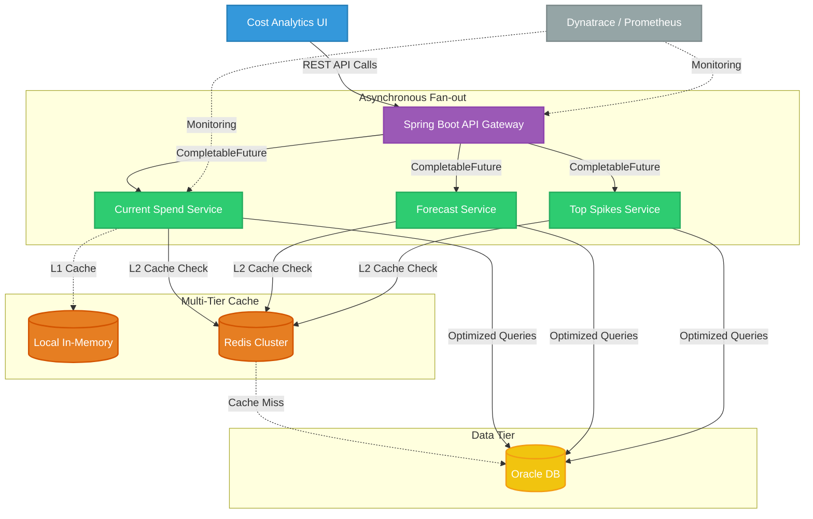

# Cloud Cost Management System

This document provides an end-to-end understanding of the Cloud Cost Management System optimization project, tailored specifically for an SDE-2 depth. It covers systemic validation, structural database and application designs, edge-case mitigation, and interview cross-questions to help you effectively communicate your architectural decisions and trade-offs.

## Table of Contents
* [STAR & Project Context](#star--project-context)
* [End-to-End System Architecture](#end-to-end-system-architecture)
* [HLD (High-Level Design)](#hld-high-level-design)
* [Deep Dive (Resilience & Scale)](#deep-dive-resilience--scale)
* [Testing & Validation](#testing--validation)
* [Question Bank & Strategies](#question-bank--strategies)

## STAR & Project Context
*   **What is Cloud Cost Management System:** A Spring Boot microservices tier deployed on Kubernetes that exposes cost analytics endpoints (aggregations by cloud provider, department, tags, etc.) for over 5K+ users.
*   **Situation:** The system suffered from severe performance bottlenecks (~850ms latency) due to heavy multi-table database joins, N+1 query patterns when fetching hierarchical rollups, synchronous sequential execution of independent aggregations, and REST payload bloat.
*   **Task:** Optimize 20+ REST APIs to drastically reduce server response times and improve data retrieval speeds without overwhelming the database or sacrificing data accuracy.
*   **Action:** We fundamentally restructured the database layer using composite indexing and window functions (to replace N+1 queries), implemented an L1/L2 multi-tier caching strategy, refactored the API gateway to use concurrent asynchronous fan-outs via `CompletableFuture`, and streamlined JSON DTOs.
*   **Result:** Achieved a 15% increase in data retrieval speeds and a 12% reduction in overall API response times (from ~850ms to ~740ms), drastically lowering JVM heap pressure and database CPU overhead.
*   **Why we did it (Motivation & Trade-offs):** We chose asynchronous fan-outs and a Redis L2 cache to trade slightly increased system complexity and memory footprint in exchange for massive latency reductions. The trade-off was accepting eventual consistency for cached historical data, which is highly acceptable since past billing cycles are effectively immutable.
*   **What else we could have done (Alternatives):** We heavily considered migrating the read-heavy analytics workloads to a dedicated OLAP database (like Snowflake or ClickHouse). This was ultimately discarded for this phase because it would require building a massive, complex ETL pipeline and synchronizing multiple teams, delaying the immediate performance relief our users needed.

## End-to-End System Architecture

*   **Phase 1: Trigger & Gateway Ingestion**
    *   **Event/Trigger:** The UI requests a complex cost dashboard requiring multiple distinct data domains (e.g., Current Spend, Forecast, Top Spikes).
    *   **Action/Mechanism:** The Spring Boot API Gateway intercepts the HTTP request and validates authentication and permissions using a short-lived L1 (in-memory) cache for configuration data.
    *   **Benefit/Result:** Reduces immediate database lookup latency for rapidly changing, small-footprint configuration and mapping data.

*   **Phase 2: Asynchronous Fan-Out**
    *   **Event/Trigger:** The Gateway identifies the need to fetch disjointed aggregation datasets from internal microservices.
    *   **Action/Mechanism:** Spawns parallel asynchronous tasks using `CompletableFuture.allOf()` backed by a custom, tuned `ExecutorService` (sized for IO-bound tasks) to query downstream services simultaneously.
    *   **Benefit/Result:** Drops total response time from the sum of all queries to just the execution time of the single longest-running query.

*   **Phase 3: Data Retrieval, Caching & Evaluation**
    *   **Event/Trigger:** Microservices receive requests for their specific data slices.
    *   **Action/Mechanism:** Services first check the L2 Redis distributed cache for immutable historical aggregates. On a cache miss, they query the Oracle DB using projection-based queries and optimized window functions (e.g., `SUM() OVER(PARTITION BY)`).
    *   **Benefit/Result:** Bypasses DB recalculation for massive historical datasets and entirely eliminates N+1 query overhead in the ORM.

*   **Phase 4: Assembly, Fallback & Payload Optimization**
    *   **Event/Trigger:** Asynchronous futures complete and return raw datasets to the API Gateway.
    *   **Action/Mechanism:** The Gateway aggregates the results into streamlined DTOs. If a non-critical future times out, a fallback default is supplied. Jackson annotations (`@JsonInclude(Include.NON_NULL)`) strip empty fields.
    *   **Benefit/Result:** Prevents a single service timeout from crashing the whole dashboard (Fail-open) and minimizes JVM heap allocation/network transfer size by 15%.

## HLD (High-Level Design)

## Deep Dive (Resilience & Scale)

### Asynchronous Decoupling & Circuit Breaking (Fail-Open)
To prevent monolithic synchronous bottlenecks, queries were fanned out using `CompletableFuture`. Crucially, we avoided the default `ForkJoinPool.commonPool()` which can lead to thread starvation across the JVM. Instead, a custom `ExecutorService` sized for I/O bounds was used. If a downstream service fails or times out (`orTimeout()`), we utilized `.exceptionally()` to fail-open—returning default or cached data for that specific dashboard widget rather than throwing a 500 error for the entire request.

### Advanced DB Tuning: Composite Indexing & Window Functions
Database latency was mitigated by strictly applying the rule of left-to-right index prefixing. Composite B-Tree indexes were created with high-cardinality equality keys first (`tenant_id`, `billing_period`), followed by range/grouping keys (`service_name`). Furthermore, ORM N+1 query associations for hierarchical cost rollups were ripped out and replaced with native SQL window functions (`SUM() OVER (PARTITION BY ...)`), allowing a single database pass to flatten the hierarchical data.

### Multi-Tier Caching & Thundering Herd Mitigation
We split caching into L1 (local memory) for highly accessed, mutable configs (cost center mappings) and L2 (Redis) for massive, immutable historical billing data. To prevent a "thundering herd" scenario—where a mass L2 cache expiration causes all concurrent API calls to suddenly hammer the Oracle database—we implemented TTL jitter (adding random variance to expiration times) so that cache invalidations naturally stagger.

### Payload Efficiency & Garbage Collection Relief
Large REST payloads with unused entity graph metadata caused high JVM heap pressure and CPU spikes during serialization. By switching to specific projection-based DB queries (`SELECT field1, field2`), mapping only to minimal DTOs, and utilizing `@JsonInclude(Include.NON_NULL)`, we dramatically reduced JSON bloat, easing garbage collection pauses and network payload sizes.

## Testing & Validation 

1. **Unit & Integration Testing:** We utilized WireMock to simulate external cloud provider APIs, and ran Testcontainers (or in-memory H2) to rigorously test our new projection-mappings and SQL window functions against realistic data schemas.
2. **Resilience Testing:** We used tools like Toxiproxy to artificially inject network latency and simulate 500 Internal Server Errors from downstream microservices. This proved that our `CompletableFuture` timeouts and `.exceptionally()` fallback mechanisms correctly degraded the UI gracefully without crashing the Gateway thread.
3. **Concurrency Testing:** We used Apache JMeter to blast the API Gateway with high-concurrency read requests. This validated that our custom `ExecutorService` did not exhaust threads under load, and verified that the L1/L2 caches successfully shielded the Oracle DB connection pool from being drained.

## Question Bank & Strategies

**1. "How did you isolate the performance bottlenecks across these 20+ APIs?"**
*   **Strategy:** Explain your diagnostic workflow methodically—show that you look at metrics before guessing at code.
*   **Sample Answer:** "Situation: Users reported severe dashboard lag. Task: I needed to pinpoint the exact bottleneck in a complex microservice architecture. Action: I didn't just guess; I opened Dynatrace APM to trace the request lifecycles. I saw JVM CPU and Network I/O were healthy, but the database processing time was dominating the trace. I then pulled the raw SQL queries and ran `EXPLAIN PLAN` in Oracle, which immediately exposed massive full table scans and nested loops. Result: This methodical isolation allowed me to focus my efforts precisely on indexing and N+1 query elimination, eventually dropping latency by 12%."

**2. "Why did you choose composite indexes, and how did you determine the column order?"**
*   **Strategy:** Demonstrate deep relational database knowledge regarding cardinality and execution plans.
*   **Sample Answer:** "Situation: Our cost filtering queries were triggering expensive full table scans. Task: I needed to design an index to serve multiple query patterns efficiently. Action: I implemented a composite B-Tree index strictly following the left-to-right prefixing rule. I placed high-cardinality, exact-match columns like `tenant_id` and `billing_period` first to aggressively narrow the search space. I followed these with range and grouping keys like `service_name`. Result: This index-seek optimization prevented sequential scanning and reduced our Oracle execution plan costs by over 40%."

**3. "You mentioned using `CompletableFuture` for fan-outs. How did you manage thread pools and handle failures?"**
*   **Strategy:** Show you understand thread pool starvation and fail-open/graceful degradation patterns.
*   **Sample Answer:** "Situation: The monolithic endpoint executed disparate aggregations sequentially. Task: I needed to run these concurrently without crashing the gateway. Action: I utilized `CompletableFuture.allOf()`, but explicitly backed it with a custom, bounded `ExecutorService` sized for IO-bound tasks so we wouldn't exhaust the JVM's common ForkJoin pool. I also chained `.orTimeout()` and `.exceptionally()` to handle failures. Result: If the 'Forecast' microservice timed out, the system degraded gracefully—it returned the 'Current Spend' data with a default forecast state, completely avoiding a catastrophic 500 error for the end-user."

**4. "How do you handle pagination on massive cloud billing datasets without running out of memory or timing out?"**
*   **Strategy:** Prove you know why standard OFFSET/LIMIT scales poorly, and how Keyset (cursor) pagination solves it.
*   **Sample Answer:** "Situation: Exporting historical billing records timed out when users navigated to deep pages. Task: I needed a resilient way to paginate massive tables. Action: I identified that standard `OFFSET/LIMIT` degrades because the database still has to fetch, scan, and discard thousands of preceding rows. I refactored our APIs to use Keyset, or cursor-based, pagination (`WHERE id > :last_seen_id LIMIT 50`). Result: This shifted the query to a constant-time O(1) index seek. Page 1,000 now loads exactly as fast as page 1, completely eliminating our timeout issues."

**5. "With Redis holding historical data, how did you handle cache invalidation and the thundering herd problem?"**
*   **Strategy:** Articulate caching strategies based on data mutability and safeguards against database spikes.
*   **Sample Answer:** "Situation: Historical aggregates were recalculating on every hit, overwhelming the DB. Task: I needed a caching layer that wouldn't result in stale configs or crash the DB upon expiration. Action: I built a multi-tier cache. Short-lived L1 for hot, mutable configs, and Redis L2 for immutable past billing data. To prevent a thundering herd crash—where L2 TTLs expire and thousands of requests hit the DB at once—I added a random time jitter to the TTLs. Result: Cache invalidations naturally staggered, keeping our database protected from traffic spikes while returning data 15% faster."

---
Validating the performance jump is just as critical as writing the code. A solid monitoring setup proves to the team and stakeholders that the optimization actually worked.
Database & Data Modeling Level
 * Pagination: Never return unbounded lists. Implement offset/limit or cursor-based pagination to ensure the API only loads and returns a fixed chunk of data (e.g., 20 items per page), keeping memory usage predictable.
 * Database Indexing: Identify the columns frequently used in WHERE, ORDER BY, or JOIN clauses and add indexes to them. This prevents the database from performing slow, full-table scans.
 * Aggregator Tables (Denormalization): Instead of executing complex, multi-table JOINs or grouping operations on every API call, use a scheduled background job to pre-calculate these metrics and store them in a single, flat aggregator table that the API can read instantly.
 * Selective Fetching (No SELECT *): Explicitly retrieve only the exact columns needed for the JSON response. Pulling heavy, unused columns wastes database memory and application network bandwidth.
Application & ORM Level
 * Fixing N+1 Queries: Prevent the ORM from executing one query to get a list of items, and then looping through to fire N more queries for related data. Use eager loading (e.g., JOIN FETCH or select_related) to grab everything in one initial query.
 * Database Connection Pooling: Avoid the massive overhead of opening a new TCP connection and authenticating for every single API request. Enable a connection pool so the application reuses a set of already-open database connections.
Caching & Architecture Level
 * Simple Key-Value Caching (Redis): For data that is heavy to compute but rarely changes, intercept the request. If the data is in Redis, return it instantly. If not, query the database, save it to Redis with a Time-To-Live (TTL), and return the response.
 * Asynchronous Backgrounding: Do not block the API response waiting for slow, secondary tasks (like sending emails or writing audit logs). Immediately return a 200 OK or 202 Accepted to the client and hand the heavy task to a background worker or event stream.
Network & Transport Level
 * Payload Compression: Enable Gzip or Brotli compression via simple framework middleware or reverse proxy configurations. This can shrink a large text-based JSON payload by 80% or more before it travels over the network.
 * HTTP Caching Headers: Use Cache-Control or ETag headers in the API response. If a client requests data that hasn't changed, the server can return a tiny 304 Not Modified status, instructing the browser to use its locally cached version.
Measurement & Validation Level
 * Endpoint Performance Dashboards: Use internal monitoring dashboards (like Grafana, Datadog, or custom APM tools) to track response times for each endpoint over a 24-hour baseline. By comparing the average, 95th percentile (p95), and 99th percentile (p99) response times before and after a deployment, you can definitively quantify the performance jump.
