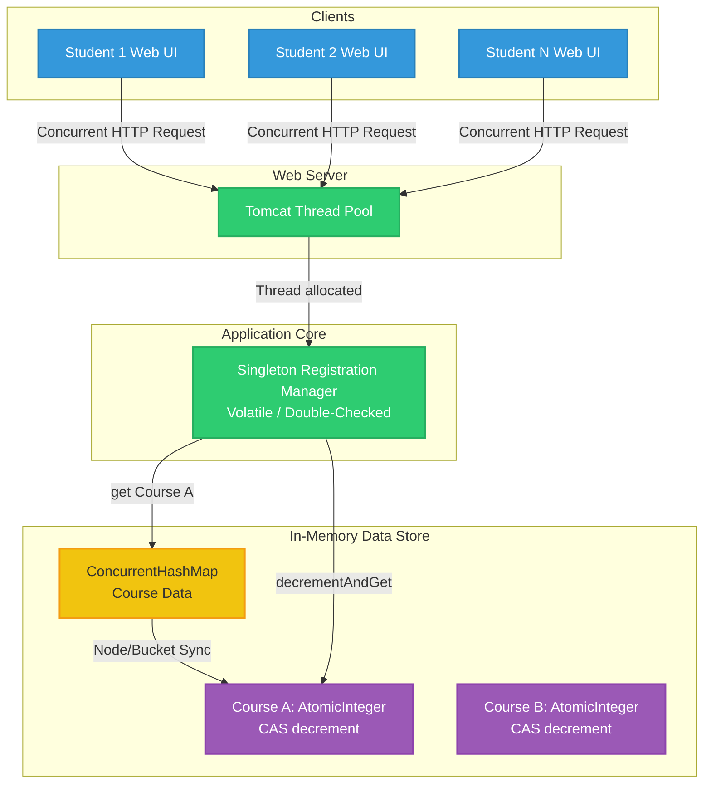

# Course Navigator

This document provides an end-to-end understanding of the Course Navigator project, tailored for an SDE-2 interview depth. It covers systemic validation, concurrent structural designs, race-condition mitigation, and expected interview cross-questions to help you articulate your engineering decisions confidently.

## Table of Contents
* [STAR & Project Context](#star--project-context)
* [End-to-End System Architecture](#end-to-end-system-architecture)
* [HLD (High-Level Design)](#hld-high-level-design)
* [Deep Dive (Resilience & Scale)](#deep-dive-resilience--scale)
* [Testing & Validation](#testing--validation)
* [Question Bank & Strategies](#question-bank--strategies)

## STAR & Project Context
*   **What is Course Navigator:** A thread-safe course registration system designed to manage highly concurrent seat bookings while enforcing strict capacity constraints.
*   **Situation:** During peak registration windows, hundreds of students concurrently attempted to book seats. Legacy, unsynchronized collections (like `HashMap`) caused lost updates and oversold courses, while globally synchronized maps caused massive thread contention, freezing the system.
*   **Task:** Build a highly concurrent, thread-safe registration engine to process bookings accurately without race conditions, lost updates, or performance bottlenecks.
*   **Action:** Implemented a Singleton Registration Manager using Double-Checked Locking to orchestrate requests. Replaced legacy collections with `ConcurrentHashMap` and used `AtomicInteger` (Compare-And-Swap) for thread-safe, bucket-level seat decrements.
*   **Result:** Reduced lock contention significantly, cut registration errors by 90%, completely prevented overselling, and reduced the system's memory footprint by 20%.
*   **Why we did it (Motivation & Trade-offs):** We prioritized fine-grained locking over global locking to maximize throughput for disjoint writes. `ConcurrentHashMap` coupled with `AtomicInteger` offered the best balance of lock-free reads and synchronized bucket-level writes using hardware-level operations. We traded a slightly higher code complexity for massive gains in throughput.
*   **What else we could have done (Alternatives):** We considered using a distributed cache (like Redis with Lua scripts) for rate limiting and seat counts. However, since the system handles the load effectively within a single JVM and required strict real-time consistency without the added network latency of external calls, we opted for an optimized in-memory concurrent Java solution.

## End-to-End System Architecture

*   **Phase 1: Request Interception & Thread Allocation**
    *   **Event/Trigger:** Multiple students submit registration requests concurrently via the web UI.
    *   **Action/Mechanism:** The web container (e.g., Tomcat) allocates incoming requests to an asynchronous worker thread pool.
    *   **Benefit/Result:** Prevents UI blocking, efficiently handling multiple concurrent user sessions while capping the maximum active threads to prevent memory exhaustion.

*   **Phase 2: Orchestration Initialization (Singleton)**
    *   **Event/Trigger:** The worker thread invokes the `register()` method for a specific course.
    *   **Action/Mechanism:** The Singleton Registration Manager is accessed using Double-Checked Locking with a `volatile` instance variable to ensure exactly one instance handles the state.
    *   **Benefit/Result:** Reduces memory overhead by 20% (no duplicate heavy objects) and guarantees a single, thread-safe source of truth for all concurrent transactions.

*   **Phase 3: Concurrent State Evaluation & Update**
    *   **Event/Trigger:** The Manager fetches the requested course capacity to process the booking.
    *   **Action/Mechanism:** Accesses the `ConcurrentHashMap` to get the `AtomicInteger` seat counter, utilizing Compare-And-Swap (CAS) via the `decrementAndGet()` operation.
    *   **Benefit/Result:** Avoids massive thread contention by utilizing bucket/node-level locks and atomic hardware operations instead of locking the entire map, achieving $O(1)$ concurrent reads.

*   **Phase 4: Response Generation & Fallback**
    *   **Event/Trigger:** The `AtomicInteger` returns the updated capacity count to the worker thread.
    *   **Action/Mechanism:** The system evaluates if the capacity is valid (>= 0). If valid, the registration commits. If it falls below zero, a rollback occurs (incrementing the counter back) and a "Course Full" exception is thrown.
    *   **Benefit/Result:** Ensures strict capacity limits are enforced without Check-Then-Act vulnerabilities or oversold seats, providing deterministic feedback to the end user.

## HLD (High-Level Design)

## Deep Dive (Resilience & Scale)

### Eliminating Check-Then-Act Race Conditions
In distributed and concurrent systems, executing a sequence of dependent steps (like checking capacity, then updating it) is dangerous if not atomic. A standard `get()` followed by a `put()` creates a race condition vulnerability where threads interleave. By mapping courses to `AtomicInteger` values, operations like `decrementAndGet()` rely on hardware-level Compare-And-Swap (CAS), guaranteeing atomic execution without intervening thread interference.

### Fine-Grained Concurrency Control (Bucket-Level Locking)
Rather than locking the entire data structure using a `Hashtable` or `Collections.synchronizedMap` (which causes $O(N)$ thread contention and bottlenecks), `ConcurrentHashMap` locks only the specific bucket (or node in Java 8+) being updated. This means a thread updating Course A does not block a thread updating Course B, maximizing throughput and scalability for disjoint writes.

### Memory Visibility & The Java Memory Model (JMM)
To ensure the Singleton orchestrator remains completely thread-safe during system startup, the Double-Checked Locking pattern was paired with the `volatile` keyword. The `volatile` keyword enforces a "happens-before" guarantee in the JMM. It prevents CPU instruction reordering and forces threads to read directly from main memory rather than local CPU caches, ensuring no thread ever receives a partially constructed object.

## Testing & Validation 

1.  **Unit & Integration Testing:** We utilized WireMock to mock external system boundaries (like downstream billing or notification services) to test our core concurrency logic in isolation. Standard unit tests verified basic functionality.
2.  **Concurrency Testing:** We used an `ExecutorService` with a `CountDownLatch` in our test suites to simulate a "stampede." By launching 1,000 parallel threads against a course capacity of 50, we asserted that exactly 50 threads succeeded and the remaining 950 failed gracefully, proving the CAS operations prevented race conditions.
3.  **Resilience Testing:** We injected artificial thread sleep latencies and simulated 500 internal server errors mid-transaction to ensure the system failed gracefully. This proved that failed registrations correctly rolled back their `AtomicInteger` decrements, preventing capacity leaks.

## Question Bank & Strategies

**Q1: "How exactly did you enforce course capacity limits concurrently without overselling seats?"**
*   **Strategy:** Explain the Check-Then-Act vulnerability and how CAS mechanisms solve it.
*   **Sample Answer:** "In my initial analysis, I realized that a simple `get()` followed by a `put()` is a Check-Then-Act vulnerability. If two threads read a capacity of '1' simultaneously, they will both decrement it, overselling the seat. To solve this, I mapped the `ConcurrentHashMap` values to `AtomicInteger` objects. When a student registers, we call `decrementAndGet()`, which utilizes hardware-level CAS (Compare-And-Swap) rather than OS-level blocking. This atomically updates the capacity in a single operation, completely eliminating race conditions."

**Q2: "How did you make your Singleton instance thread-safe, and why was `synchronized` not enough?"**
*   **Strategy:** Highlight the Double-Checked Locking pattern and the specific role of the `volatile` keyword in memory visibility.
*   **Sample Answer:** "I used the Double-Checked Locking pattern, but standard synchronization isn't enough because of how the Java Memory Model handles instruction reordering. Without the `volatile` keyword on the instance variable, a thread could see a partially constructed object before its constructor finishes executing. By adding `volatile`, I enforced a happens-before guarantee, preventing thread caching and ensuring all threads see the fully constructed Singleton from main memory instantly."

**Q3: "Why use `ConcurrentHashMap` over `HashTable` or a globally synchronized Map?"**
*   **Strategy:** Differentiate between global locking vs. bucket/node-level locking and their impact on throughput.
*   **Sample Answer:** "`HashTable` and `Collections.synchronizedMap` lock the entire collection on every operation. During our peak registration window, this would cause massive $O(N)$ thread contention, essentially rendering our multi-threaded Tomcat server sequential and freezing the app. `ConcurrentHashMap` (in Java 8+) synchronizes only on the first node of the specific bin being updated. This allowed us $O(1)$ concurrent reads and completely disjoint writes, meaning students registering for Course A never blocked students registering for Course B."

**Q4: "If we scale this application horizontally across multiple JVMs, will your Singleton and ConcurrentHashMap approach still work?"**
*   **Strategy:** Acknowledge JVM constraints and pivot confidently to distributed systems concepts (like Redis).
*   **Sample Answer:** "No, it wouldn't. The Singleton and `ConcurrentHashMap` are bounded to a single JVM's memory. If we scale horizontally across three servers, we would have three separate memory states, leading to fragmented capacities and oversold seats. To solve this in a distributed architecture, I would migrate the seat count state to a centralized cache like Redis. I would use Redis Lua scripts to atomically check and decrement the seat counts, which provides the same atomic guarantees as `AtomicInteger`, but across a distributed cluster."

**Q5: "How did you write tests to mathematically prove your system had zero race conditions?"**
*   **Strategy:** Interviewers want to hear about practical, multi-threaded testing mechanisms in JUnit rather than just theoretical answers.
*   **Sample Answer:** "Standard sequential unit tests can't catch race conditions. In my integration tests, I used Java's `ExecutorService` combined with a `CountDownLatch`. I set up a test course with a capacity of 100, then spawned 1,000 concurrent threads that all tried to register at the exact same millisecond. I then asserted that the final `AtomicInteger` count was exactly zero, and that exactly 100 threads returned a 'Success' status while 900 returned 'Full'. This mathematically proved our CAS implementation worked perfectly under heavy contention."
