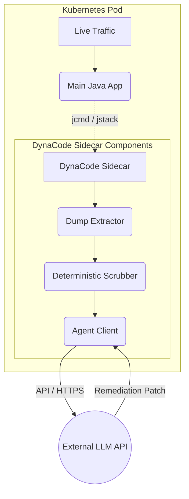

# DynaCode: Agentic Dynamic Code Analyzer (Deep Dive)

## Table of Contents
1. [Project Overview & Motivation](#1-project-overview--motivation)
2. [High-Level Architecture](#2-high-level-architecture)
3. [Core Components & Technical Implementation](#3-core-components--technical-implementation)
4. [Interview Defense / Cross-Examination (SDE-2 Level)](#4-interview-defense--cross-examination-sde-2-level)

---

## 1. Project Overview & Motivation

**What it is:** DynaCode is an advanced, runtime diagnostic system designed to safely debug live Java applications experiencing complex, highly concurrent issues (such as deadlocks, memory leaks, or thread contention) without disrupting user traffic or requiring environment replication.

**The Problem:** Traditional runtime visibility in production is inherently risky. Capturing full heap or thread dumps on the main application thread can trigger "pause-the-world" garbage collection events or lock up the JVM, leading to cascading failures or Out-Of-Memory (OOM) pod evictions.

**The Solution:** We secured 1st place in a firmwide Hackathon by developing an agentic diagnostic system utilizing a Kubernetes sidecar pattern. This isolated diagnostic "sidecar" safely extracts state representations (memory/threads), parses them deterministically to remove noise and PII, and feeds the focused bottleneck data to an AI agent to dynamically propose a remediation patch.

---

## 2. High-Level Architecture

The architecture utilizes a strict boundary separation to ensure safety. The diagram below illustrates the flow of diagnostic data from the main application to the external remediation agent.

*(Note: Please refer to the companion `dynacode-architecture.html` file for the formal, stylized architecture diagram).*
### Fallback Mermaid Diagram

---

## 3. Core Components & Technical Implementation

### Kubernetes Sidecar Pattern
The diagnostic agent is deployed as a Kubernetes sidecar container. It resides in the exact same pod as the main application, sharing the same network namespace and volume mounts. However, it is strictly governed by isolated resource limits (cgroups). This ensures that heavy I/O operations (like writing a massive thread dump to disk) consume the sidecar's resources, leaving the main application's CPU and memory untouched.

### Sandboxed Diagnostic Extraction
When anomalous behavior (like elevated latency or unexplainable memory growth) is detected, the sidecar triggers JVM diagnostics against the main container (using tools like `jstack` or `jcmd`). Because the sidecar operates in a sandboxed execution context, these aggressive operations do not cannibalize the primary application threads.

### Deterministic Parsing & PII Scrubbing
Raw Java thread dumps and heap dumps are massive and frequently contain sensitive payload data or Personally Identifiable Information (PII). Before any data leaves the secure pod boundary, the sidecar executes deterministic Python/bash scripting. This script strips away idle threads, scrubs known sensitive memory blocks, and strictly isolates threads existing in a `BLOCKED` or `WAITING` state.

### Automated Remediation Agent
By shrinking the diagnostic payload via deterministic parsing, we drastically reduce the context window size sent to the LLM. The AI agent analyzes the isolated deadlock sequence or long-running thread pattern and synthesizes a patch proposal (e.g., reordering synchronization blocks, adjusting lock ordering, or suggesting asynchronous non-blocking alternatives) to remediate the root cause.

---

## 4. Interview Defense / Cross-Examination (SDE-2 Level)

This section contains anticipated deep-dive questions an interviewer might ask to test architectural understanding and technical maturity.

**Question 1: Explain the sidecar pattern. Why didn't you just deploy this as a separate DaemonSet on the node, or integrate it directly as an application library?**
* **Strategy:** Emphasize process isolation vs. access. If built as an application library (like a standard APM agent), generating a heavy thread dump utilizes the main application's heap and CPU, risking a direct OOM crash on the primary service. A DaemonSet provides node-level isolation but lacks the localized, shared filesystem access required to pull targeted process dumps seamlessly. The sidecar shares the pod's network and filesystem boundaries (allowing it to execute `jstack` against the main PID) but utilizes separate cgroup resource quotas, completely insulating the main app from the diagnostic overhead.

**Question 2: How does the agent parse and understand raw Java thread dumps without hallucinating or running out of context window tokens?**
* **Strategy:** Highlight the hybrid deterministic/probabilistic approach. LLMs are not efficient at reading 100,000 lines of raw text. The sidecar first runs deterministic scripting (parsing `jstack` standard output) to strip away all `RUNNABLE` or idle worker pool threads. It strictly filters for threads in `BLOCKED` states and traces the object monitors they are waiting on. This distills a massive file down to a few hundred lines of highly relevant bottleneck data, fitting perfectly into the LLM context window and preventing hallucinations.

**Question 3: Taking a heap dump on a production service is incredibly dangerous. How did you handle PII and sensitive user data before sending it to an external AI agent?**
* **Strategy:** Acknowledge the severity of data exfiltration. Explain that in the hackathon MVP, we relied primarily on Thread Dumps (which usually contain class paths and lock states, not payload values). For heap analysis, we implemented a rigorous PII scrubbing step. Before transmission, the scrubber utilizes regex and memory offset mapping to mask out known string payloads or sensitive object fields. Emphasize that in a true production rollout, the LLM itself would need to be hosted internally (e.g., a localized, firm-hosted model) rather than a public API to guarantee compliance.

**Question 4: What happens if the AI agent's proposed patch introduces a new, subtle concurrency bug? How do you handle false positives?**
* **Strategy:** Pivot to deployment safety and human-in-the-loop validation. The LLM does not execute the patch directly into the running bytecode. It generates a "proposed remediation pull request." As an SDE-2, emphasize that AI is a diagnostic accelerant, not a replacement for CI/CD guardrails. The proposed patch must still pass existing automated integration tests and receive a human architectural review before being merged.
