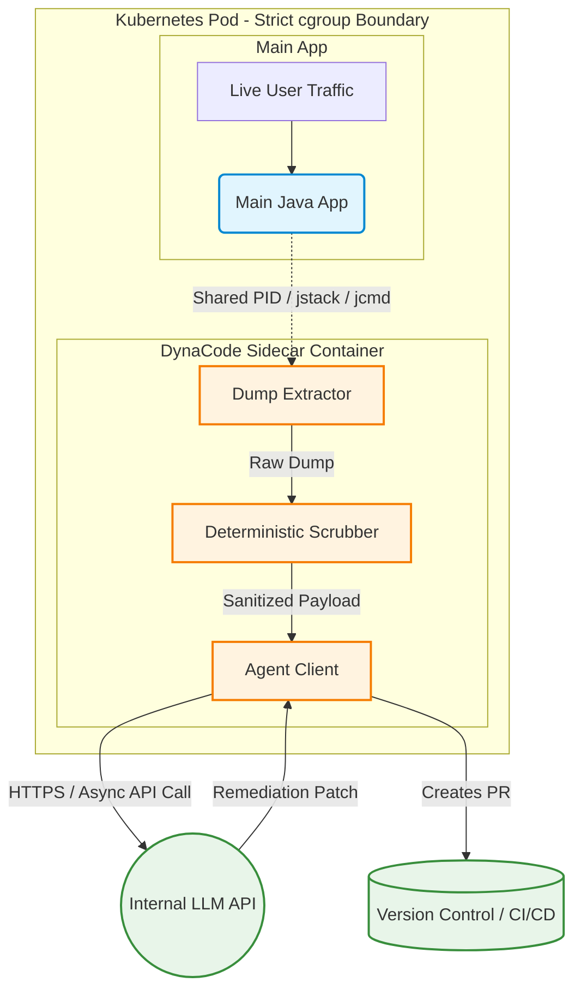

# DynaCode: Agentic Dynamic Code Analyzer

This document serves as an end-to-end understanding of the project, tailored for an SDE-2 depth, covering systemic validation, structural designs, edge-case mitigation, and interview cross-questions. It provides a comprehensive blueprint to clearly articulate architectural trade-offs, system resilience, and business impact during technical interviews.

## Table of Contents
* [STAR & Project Context](#star--project-context)
* [End-to-End System Architecture](#end-to-end-system-architecture)
* [HLD (High-Level Design)](#hld-high-level-design)
* [Deep Dive (Resilience & Scale)](#deep-dive-resilience--scale)
* [Testing & Validation](#testing--validation)
* [Question Bank & Strategies](#question-bank--strategies)

## STAR & Project Context

*   **What is DynaCode:** A Kubernetes sidecar-based diagnostic tool that dynamically analyzes production applications to detect and resolve concurrency and memory issues using AI, without disrupting live traffic.
*   **Situation:** In the current development life cycle every engineer does static code anaylsis. i.e looking at the code structure syntactically making sure the if else logic is correct we are using the optimal library or objects but there’s dynamic code analysis that is mostly not done. In Dynamic analysis we analyze the application in a running state looking through the memory usages, thread counts, connection pools or deadlocks. 
*   **Task:** as part of the hackathon we built a dynamic code analyzer that analyzes critical production services identify complex runtime issues and provide resolutions without impacting user traffic. 
*   **Action:** we implemented a Kubernetes sidecar pattern with isolated resource (cgroups) to safely extract JVM dumps (jcmd/jstack). We then process it to remove redundant information feeding only the bottleneck data to an internal LLM agent.
*   **Result:** The system successfully identified root causes for deadlocks and memory leaks in live environments, automatically generated remediation patches, caused zero degradation to live traffic, and won 1st place in a firmwide hackathon.
*   **Why we did it (Motivation & Trade-offs):** We chose a sidecar architecture to guarantee strict hardware resource isolation. By forcing heavy I/O operations (like writing massive thread dumps) to run against the sidecar's resource quotas, we accepted the trade-off of slightly higher base memory usage per pod in exchange for absolute protection against main-app OOM crashes.
*   **What else we could have done (Alternatives):** We considered deploying a DaemonSet on the Kubernetes nodes for global observability. However, this was discarded because DaemonSets lack the granular, shared filesystem and PID namespace access required to easily trigger native JVM tools against a specific application container without highly complex, elevated security privileges and host-path mounts. We also considered an in-app APM library, but discarded it as it would share the JVM heap, defeating the purpose of isolating the diagnostic overhead.

## End-to-End System Architecture

*   **Phase 1: Anomalous Event Trigger & Extraction**
    *   **Event/Trigger:** System metrics (e.g., latency spikes, memory threshold breaches) trigger a diagnostic capture.
    *   **Action/Mechanism:** The sidecar executes `jstack` or `jcmd` via the shared PID namespace to capture the application's current thread/heap state into a shared volume.
    *   **Benefit/Result:** Operates out-of-band from the main application thread, ensuring zero computational overhead is added to the request-handling process.

*   **Phase 2: Deterministic Data Scrubbing**
    *   **Event/Trigger:** Raw dump files are written to the shared filesystem.
    *   **Action/Mechanism:** A highly optimized script parses the dump, stripping out `RUNNABLE` and idle threads, keeping only threads in `BLOCKED` or `WAITING` states. It applies regex masking to scrub sensitive object fields and PII.
    *   **Benefit/Result:** Drastically reduces the payload size to fit within an LLM's context window while strictly enforcing data privacy and compliance.

*   **Phase 3: Agentic Evaluation**
    *   **Event/Trigger:** The sanitized, minimized bottleneck payload is ready.
    *   **Action/Mechanism:** The sidecar acts as a client, making an asynchronous, circuit-broken API call to an internal LLM endpoint with the payload and a strict diagnostic prompt.
    *   **Benefit/Result:** Offloads heavy cognitive debugging work, rapidly identifying complex race conditions, lock ordering issues, or memory leaks that are difficult for humans to spot.

*   **Phase 4: Remediation & Fallback (Human-in-the-Loop)**
    *   **Event/Trigger:** The LLM returns a proposed code fix.
    *   **Action/Mechanism:** Instead of auto-deploying, the system generates a formal Pull/Merge Request detailing the issue, the blocked monitor objects, and the proposed patch.
    *   **Benefit/Result:** Adheres to a "fail-safe" philosophy. By enforcing standard CI/CD checks and human code review, we mitigate the risk of AI hallucinations breaking production systems.

## HLD (High-Level Design)

## Deep Dive (Resilience & Scale)

### Linux Cgroups & Blast Radius Isolation
To ensure production stability, the system heavily relies on container orchestration primitives. By deploying DynaCode as a sidecar, Kubernetes applies separate Linux control groups (cgroups) to the diagnostic tools. If extracting a 4GB heap dump causes a memory spike, the OOM killer will exclusively target and restart the sidecar container, leaving the main Java app and its live traffic completely unaffected. This is a classic "bulkhead" pattern at the infrastructure level.

### Deterministic Noise Reduction & Token Optimization
LLMs suffer from degraded reasoning (hallucinations) when fed massive, unstructured text like a 100,000-line thread dump. The system scales its analytical capability by relying on a deterministic pre-processing layer. By programmatically dropping `RUNNABLE` threads and extracting only `BLOCKED` threads and their associated object monitors, the system performs an O(N) reduction on data size. This guarantees the payload stays well within the LLM token limits, reduces API latency, and improves the accuracy of the AI's root-cause analysis.

### Asynchronous Decoupling & Circuit Breaking
The connection between the Agent Client and the LLM API is designed to fail gracefully. If the internal LLM API goes down or experiences high latency, the Agent Client utilizes a Circuit Breaker pattern. It will fail-open (stop sending requests) and simply log the parsed thread dump to standard observability tools (like Splunk/Datadog) without blocking the sidecar's event loop or endlessly retrying, ensuring network threads aren't exhausted.

## Testing & Validation 

1. **Unit & Integration Testing:** We utilized WireMock to simulate the external LLM API, ensuring the Agent Client correctly handled JSON parsing, timeouts, and retries. We also wrote unit tests for the deterministic scrubber against static, known thread dumps to verify PII regex masking was 100% effective.
2. **Resilience Testing (Chaos Engineering):** We intentionally constrained the sidecar's memory limits in a staging environment and triggered massive heap dumps. This validated that when the sidecar hit an OOM state, the Kubernetes scheduler restarted only the sidecar, while the main application container continued serving HTTP 200 responses without latency spikes.
3. **Concurrency Testing:** We deployed a dummy application configured with an intentional, easily triggered deadlock (Thread A waiting on Lock 1 holding Lock 2; Thread B waiting on Lock 2 holding Lock 1). We subjected it to high load using JMeter to ensure the sidecar correctly identified the exact lock monitors involved in the race condition.

## Question Bank & Strategies

**Q1: Why use a sidecar pattern? Why not a DaemonSet on the node or just an APM library inside the app?**
*   **Strategy:** The interviewer is looking for your understanding of resource isolation (cgroups) vs. shared state, and deployment trade-offs in distributed systems.
*   **Sample Answer:** "In a previous iteration of my thought process, I considered an APM library, but taking a heavy dump inside the app shares the JVM resources and can easily cause an OOM crash on the main thread. A DaemonSet provides good isolation at the node level, but it lacks the shared network and PID namespaces required to easily execute tools like `jstack` against a specific pod. I chose the sidecar pattern because it perfectly balances these needs: it shares the pod's namespace to easily extract data, but it operates under its own resource quotas, guaranteeing that the main application's CPU and heap remain completely insulated from our diagnostic overhead."

**Q2: How do you prevent the AI from hallucinating or hitting token limits when processing massive thread dumps?**
*   **Strategy:** Demonstrate understanding of LLM limitations (context windows, noise-to-signal ratio) and how traditional algorithmic programming supports AI.
*   **Sample Answer:** "I realized early on that feeding raw, 100,000-line thread dumps to an LLM would result in token exhaustion and severe hallucinations. To solve this, I introduced a deterministic pre-processing phase. Before the LLM ever sees the data, a script parses the dump, strips out all idle and `RUNNABLE` threads, and extracts only the threads stuck in `BLOCKED` or `WAITING` states, along with their lock monitors. This brought the payload down to just a few hundred lines of high-signal data. By doing the heavy lifting deterministically, the AI only processes the actual bottleneck, which drastically improved patch accuracy and kept us well under token limits."

**Q3: Taking a heap dump in production is a massive security risk due to PII in memory. How did you architect the system to handle this?**
*   **Strategy:** Show a strict adherence to security boundaries, zero-trust principles, and data sanitization before data leaves the environment.
*   **Sample Answer:** "Security was a primary constraint. First, for our MVP, we relied heavily on Thread Dumps, which primarily expose class paths and lock states rather than in-memory user data. However, to support deeper heap analysis, I implemented a strict scrubbing layer inside the sidecar itself. The sidecar uses regex-based masking to scrub known sensitive string patterns and object fields before the data ever leaves the pod's network boundary. Furthermore, I designed this to integrate exclusively with our firm-hosted, internal LLM, ensuring that no sanitized data, let alone PII, ever crosses the public internet."

**Q4: What if the AI generates a code fix that introduces a new bug or an even worse concurrency issue?**
*   **Strategy:** Highlight your understanding of CI/CD, human-in-the-loop systems, and fail-safe deployment practices.
*   **Sample Answer:** "I treated the AI strictly as an advanced diagnostic assistant, not an automated deployment tool. To mitigate the risk of hallucinatory code, I architected the final phase of the system to generate a proposed Pull Request rather than merging directly. The PR includes the diagnostic context, the blocked threads, and the AI's suggested patch. This forces the code to run through our existing CI/CD integration tests and requires a mandatory human code review. This fail-safe ensures we get the speed of AI debugging without compromising our production stability gates."

**Q5: How do you manage the lifecycle of these dump files? If the sidecar triggers dumps frequently, won't you run out of disk space on the node?**
*   **Strategy:** Demonstrate operational maturity by anticipating infrastructure degradation over time (e.g., disk exhaustion).
*   **Sample Answer:** "That was a major operational risk we had to design for. Unchecked file generation will quickly exhaust the `emptyDir` volume and cause pod eviction. To prevent this, I configured the sidecar's local storage as an ephemeral volume with a strict size limit. Additionally, I implemented an automated log-rotation and cleanup script running as a cron job inside the sidecar. Once a dump is parsed, scrubbed, and successfully sent to the AI, the raw, massive dump file is immediately deleted. If the AI API is down, older dumps are evicted based on a FIFO policy to ensure disk utilization never exceeds 80%."

**Q6:  How does this handle non-JVM applications (e.g., Python, Node.js, Go)?**
Our platform separates **data collection** from **LLM analysis**, making the core architecture completely language-agnostic. 

* **Universal Core:** The Kubernetes sidecar isolation, cgroup limits, data sanitizer, and LLM diagnostic pipeline remain identical across all services.
* **Pluggable Profiling:** We swap the collection agent inside the sidecar depending on the runtime:
  * **Python:** Uses `py-spy` to inspect process memory out-of-band without pausing the GIL or modifying code.
  * **Node.js:** Traces blocked event loops and active call stacks via V8 profiling.
  * **Go:** Collects goroutine dumps and mutex contention using native `pprof`.
* **Standardized Output:** Raw runtime snapshots are sanitized into a clean, uniform format before being sent to the LLM for automated troubleshooting.
