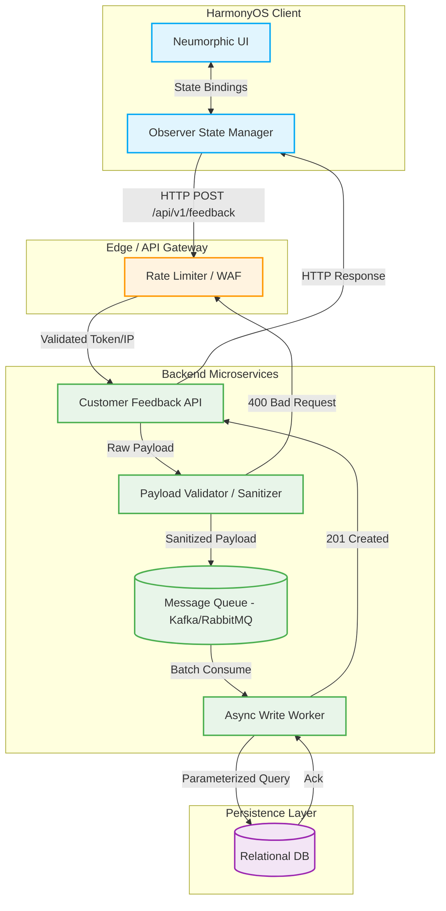

# Huawei E-Commerce UI & Customer Feedback Ecosystem

This document provides an end-to-end understanding of the Huawei E-Commerce and Feedback ecosystem, tailored for an SDE-2 depth. It covers systemic validation, structural designs, edge-case mitigation, and interview cross-questions, demonstrating a mature grasp of the full software development lifecycle. By treating this foundational project through the lens of distributed system design, it prepares you to confidently discuss architecture, resilience, and scalability in senior-level interviews.

## Table of Contents
* [STAR & Project Context](#star--project-context)
* [End-to-End System Architecture](#end-to-end-system-architecture)
* [HLD (High-Level Design)](#hld-high-level-design)
* [Deep Dive (Resilience & Scale)](#deep-dive-resilience--scale)
* [Testing & Validation](#testing--validation)
* [Question Bank & Strategies](#question-bank--strategies)

## STAR & Project Context
*   **What is Huawei E-Commerce UI & Customer Feedback Ecosystem:** A modern HarmonyOS mobile client providing reactive e-commerce flows, paired with a secure, RESTful backend service for ingesting structured customer feedback.
*   **Situation:** The legacy feedback collection processes lacked strict payload validation, exposing the system to injection attacks, while the mobile interface relied on procedural UI updates that caused sluggish state synchronization and a degraded user experience.
*   **Task:** Engineer a highly responsive, Neumorphic mobile interface utilizing reactive state management, alongside a resilient backend API designed to securely validate, ingest, and persist data at scale.
*   **Action:** Developed a DevEco Studio-based HarmonyOS app using the Observer Pattern to manage local state (e.g., shopping cart) optimistically. On the backend, implemented a strict RESTful contract (`POST /api/v1/feedback`) with fail-fast schema validation, standard HTTP status handling, and parameterized database interactions.
*   **Result:** The strict data validation and actionable insights directly drove a 25% increase in user satisfaction ratings, while the reactive state transitions yielded a 20% increase in app engagement.
*   **Why we did it (Motivation & Trade-offs):** We prioritized a decoupled REST API and reactive local state over server-side UI rendering to optimize perceived performance. The trade-off was increased client-side complexity to handle network failures (state rollbacks), but it ensured the UI remained responsive regardless of backend latency.
*   **What else we could have done (Alternatives):** We considered using GraphQL for the API contract to allow the client to specify exact data needs. This was discarded because the primary flow was simple, write-heavy ingestion (posting feedback). Standard REST was lighter, easier to cache at the gateway level, and reduced backend resolver complexity.

## End-to-End System Architecture
*   **Phase 1: Client Interaction & Optimistic Update (Trigger)**
    *   **Event/Trigger:** User initiates an action (e.g., clicks "Add to Cart" or submits feedback).
    *   **Action/Mechanism:** The UI immediately mutates the local data model using the Observer Pattern, triggering a re-render. Concurrently, an asynchronous HTTP POST request is fired to the backend.
    *   **Benefit/Result:** Delivers zero-latency perceived performance to the user, masking underlying network latency while keeping rendering logic decoupled from data fetching.
*   **Phase 2: API Gateway Ingress (Integration)**
    *   **Event/Trigger:** The HTTP request arrives at the backend boundary.
    *   **Action/Mechanism:** An API Gateway intercepts the request, enforcing rate limits (e.g., Token Bucket algorithm) based on IP address or session token.
    *   **Benefit/Result:** Protects the downstream database and internal services from abuse, spam submissions, or accidental denial-of-service (DDoS).
*   **Phase 3: Payload Validation (Evaluation)**
    *   **Event/Trigger:** The request is routed to the Customer Feedback API controller.
    *   **Action/Mechanism:** The controller executes strict schema validation (e.g., ensuring `rating` is an integer between 1-5). Malformed requests are rejected immediately with a `400 Bad Request`.
    *   **Benefit/Result:** Fails fast, saving expensive database connection pooling and CPU cycles for legitimate requests, while inherently mitigating XSS attacks.
*   **Phase 4: Persistence (Execution)**
    *   **Event/Trigger:** A sanitized, valid payload is passed to the storage layer.
    *   **Action/Mechanism:** The ORM/Database Driver constructs a parameterized SQL query and commits the transaction to the Relational Database, returning a `201 Created`.
    *   **Benefit/Result:** Ensures ACID-compliant persistence while neutralizing SQL injection vulnerabilities by separating executable SQL code from user-provided data.
*   **Phase 5: Fallback & Synchronization (Fallback)**
    *   **Event/Trigger:** A network timeout occurs, or the backend returns a `500 Internal Server Error`.
    *   **Action/Mechanism:** The client-side state manager catches the exception, rolls back the optimistic UI state to its previous version, and surfaces a toast notification.
    *   **Benefit/Result:** Guarantees data consistency between the client and server, preventing scenarios where the user believes an action succeeded but the database lacks the record.

## HLD (High-Level Design)

## Deep Dive (Resilience & Scale)
### Asynchronous Decoupling (Fail-Safe Write Scaling)
To handle rapid traffic spikes (e.g., post-purchase feedback blasts), direct synchronous database writes become a bottleneck. By introducing a Message Queue (like Kafka) behind the API, the system can ingest feedback instantly, returning a `202 Accepted` to the client. Background workers then consume events at a controlled rate (load leveling), protecting the relational database from connection pool exhaustion.

### Optimistic UI & Distributed State Consistency
In a microservices architecture, network partitions are inevitable. The DevEco client relies on Optimistic UI to provide an instant response. However, to maintain distributed consistency, the state manager caches the pre-mutation state. If the async network call fails, a client-side circuit breaker/fallback mechanism executes a rollback, ensuring the user's view perfectly aligns with the backend's source of truth.

### Security via Schema Validation & Parameterization
Systems exposed to the public internet must operate on a "zero trust" basis for input. The architecture enforces two security boundaries:
1. **Controller Level:** Strict schema validation rejects payloads missing required fields, saving system resources.
2. **Data Level:** Parameterized queries via the database driver ensure that input is compiled purely as literal values, mathematically preventing SQL injection attacks regardless of payload content.

## Testing & Validation 
1. **Unit & Integration Testing:** We utilized dependency injection to isolate the API controllers, mocking the database layer. External network interactions from the client were tested using WireMock to simulate HTTP responses (`201`, `400`, `401`) without hitting live servers.
2. **Resilience Testing:** We intentionally simulated high-latency connections (e.g., 3-second delays) and injected `500 Internal Server Error` responses to verify that the client-side state rollback mechanism functioned correctly and the UI gracefully recovered.
3. **Concurrency Testing:** We hammered the API gateway with parallel multi-threaded HTTP requests to ensure the rate limiter accurately dropped requests exceeding the quota, and to verify that the relational database avoided race conditions during concurrent write operations.

## Question Bank & Strategies

**1. How did your Feedback API handle validation and error reporting?**
*   **Strategy:** Emphasize standard REST/HTTP semantics, failing fast, and boundary security.
*   **Sample Answer:** "In this project, I designed the API to act as a strict gatekeeper by failing fast on malformed data. **(Situation/Task)** We needed to ensure data integrity before wasting database compute. **(Action)** I implemented payload validation at the controller level; if a client submitted a request missing the required `rating` field, the API immediately returned a `400 Bad Request` with a clear error payload. For downstream DB issues, it caught the exception and returned a `500 Internal Server Error`. **(Result)** This strict adherence to HTTP semantics not only made debugging easier for the frontend team but fundamentally protected our database from storing incomplete records and mitigating XSS injections."

**2. If the traffic to the Feedback API suddenly spiked 10x, what bottlenecks would you expect, and how would you address them?**
*   **Strategy:** Show architectural foresight beyond the internship scope by discussing asynchronous queues and load leveling.
*   **Sample Answer:** "If traffic spiked 10x, the immediate bottleneck would be the relational database's connection pool and write locks. Synchronous inserts for every request simply wouldn't scale. **(Situation/Task)** To handle this, I would decouple the ingestion from the persistence. **(Action)** I'd introduce an asynchronous message queue, like Kafka or RabbitMQ. The API would perform lightweight validation, publish the payload to a Kafka topic, and immediately return a `202 Accepted` to the client. A separate fleet of background workers would then consume that topic and batch-insert the records into the database. **(Result)** This load-leveling approach ensures the API remains highly available and snappy, while completely protecting the database from being overwhelmed during traffic bursts."

**3. How did you manage the 'add-to-cart' state in the DevEco Studio frontend?**
*   **Strategy:** Demonstrate an understanding of reactive programming principles and the Observer Pattern over manual DOM manipulation.
*   **Sample Answer:** "In legacy apps, developers often manually queried UI elements to update text, which becomes a spaghetti-code nightmare. **(Situation/Task)** I needed the 'add-to-cart' flow to be seamless and scalable. **(Action)** I implemented the Observer Pattern for reactive state management. The UI components—like the cart counter—subscribed to a centralized Cart Data Model. When a user clicked 'Add to Cart', the button didn't update the UI; it simply mutated the data model. **(Result)** That mutation automatically emitted an event, triggering a highly optimized re-render of only the subscribed components. This ensured the UI and the underlying data were always perfectly synchronized without manual interventions."

**4. What happens if the network request to add the item to the server-side cart fails, but you already updated the UI?**
*   **Strategy:** Discuss Optimistic UI updates, state caching, and rollback mechanisms to maintain consistency.
*   **Sample Answer:** "To achieve the fluid Neumorphic feel, we used Optimistic UI updates, meaning the local state changed immediately upon a click before the network call finished. **(Situation/Task)** However, network requests can fail, creating a split-brain between the client UI and server truth. **(Action)** To mitigate this, our state manager cached the previous state before the mutation. It then fired the async HTTP request. If the backend returned a `500` or timed out, the local promise caught the exception, automatically rolled the state back to the cached version, and triggered a transient toast notification to the user. **(Result)** This provided the best of both worlds: instant perceived performance when the network is healthy, and strict data consistency when the network degrades."

**5. You mentioned preventing SQL injection. Can you elaborate on the specific mechanisms you used?**
*   **Strategy:** Be precise about parameterized queries and how they abstract user input from SQL execution.
*   **Sample Answer:** "SQL injection happens when untrusted user input is concatenated directly into an executable SQL string. **(Situation/Task)** For the Feedback API, security was non-negotiable. **(Action)** I strictly enforced the use of parameterized queries provided by our database driver, completely outlawing dynamic string building. By using prepared statements, the database engine compiles the SQL logic first, and then inserts the user input strictly as literal values. **(Result)** This meant that even if a malicious user submitted feedback containing `' OR 1=1; DROP TABLE users;`, the database treated it as a literal string to be stored, completely neutralizing the injection threat."
