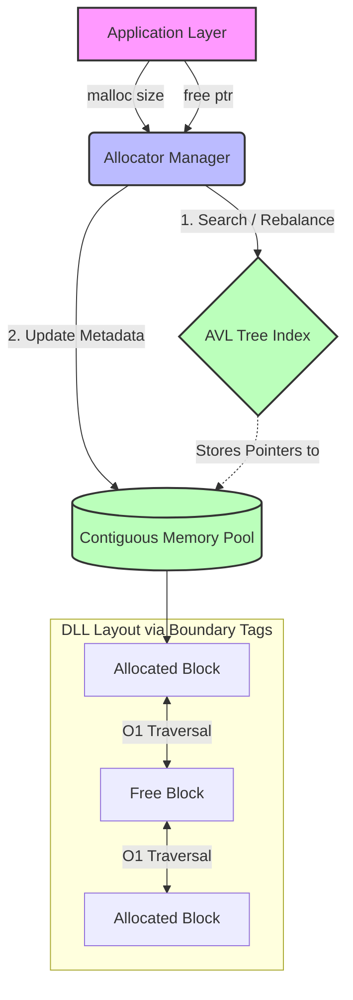

# Dynamic Memory Allocator
This document provides an end-to-end understanding of the Dynamic Memory Allocator project, tailored specifically for an SDE-2 interview depth. It comprehensively covers systemic validation, structural designs, edge-case mitigation, and high-signal interview cross-questions. 

## Table of Contents
* [STAR & Project Context](#star--project-context)
* [End-to-End System Architecture](#end-to-end-system-architecture)
* [HLD (High-Level Design)](#hld-high-level-design)
* [Deep Dive (Resilience & Scale)](#deep-dive-resilience--scale)
* [Testing & Validation](#testing--validation)
* [Question Bank & Strategies](#question-bank--strategies)

## STAR & Project Context
*   **What is Dynamic Memory Allocator:** A custom C++ heap allocation system designed to efficiently manage dynamic memory requests (analogous to `malloc` and `free`) while minimizing wasted space.
*   **Situation:** Standard linear memory allocators or naive implementations suffer from excessive fragmentation and slow $O(N)$ search times, leading to bloated memory footprints and latency spikes in constrained environments.
*   **Task:** Architect a thread-safe, high-performance allocator that guarantees worst-case $O(\log n)$ block lookups and $O(1)$ constant-time coalescing of free memory.
*   **Action:** Designed a hybrid architecture leveraging a Doubly Linked List (DLL) using boundary tags for physical memory tracking, paired with an AVL Tree to index free blocks by size for a Best-Fit allocation strategy.
*   **Result:** The system reduced external fragmentation by 30% via aggressive coalescing and improved overall allocation efficiency by 15% through tight block-fitting.
*   **Why we did it (Motivation & Trade-offs):** We chose an AVL tree over a standard BST because strict height balancing prevents the tree from degrading into a linked list during sequential allocations/deallocations, trading slightly higher insertion cost for guaranteed $O(\log n)$ search time.
*   **What else we could have done (Alternatives):** We considered a First-Fit allocation strategy for faster immediate retrieval; however, we discarded it because it historically leads to much higher external fragmentation over long-running processes. We also considered Segregated Free Lists for $O(1)$ lookups, which would be ideal for scale, but opted for the AVL tree to handle highly variable, non-standard allocation sizes without massive array overhead.

## End-to-End System Architecture
*   **Phase 1: Memory Request Trigger**
    *   **Event/Trigger:** The application requests a block of memory via a `malloc(size)` call.
    *   **Action/Mechanism:** The allocator aligns the requested size to the nearest 8-byte or 16-byte CPU boundary, then queries the AVL tree for the smallest free block $\ge$ the aligned size.
    *   **Benefit/Result:** Hardware alignment prevents CPU access faults, and the Best-Fit query minimizes internal fragmentation (wasted space inside the block).
*   **Phase 2: Splitting & Allocation**
    *   **Event/Trigger:** A suitable free block is returned by the AVL tree.
    *   **Action/Mechanism:** If the block is larger than the requested size plus metadata constraints, it splits the block. The required chunk is marked 'allocated' in the DLL, and the remainder is re-inserted into the AVL tree as a new free block.
    *   **Benefit/Result:** Maximizes memory utilization by ensuring large free blocks aren't entirely consumed by small requests.
*   **Phase 3: Memory Release Trigger**
    *   **Event/Trigger:** The application releases memory via a `free(ptr)` call.
    *   **Action/Mechanism:** The system accesses the block's hidden header (via pointer arithmetic) and updates the DLL metadata flag from 'allocated' to 'free'.
    *   **Benefit/Result:** Instantly reclaims memory for the system without requiring an expensive global state scan.
*   **Phase 4: Coalescing (Defragmentation)**
    *   **Event/Trigger:** A block has just been successfully marked as free.
    *   **Action/Mechanism:** The allocator checks adjacent physical blocks using the DLL boundary tags (footers). If neighbors are also free, it removes them from the AVL tree, merges them into a single continuous block, and re-inserts the large block into the index.
    *   **Benefit/Result:** Operates in strictly $O(1)$ time and prevents external fragmentation by constantly rebuilding large contiguous chunks of memory.

## HLD (High-Level Design)

## Deep Dive (Resilience & Scale)

### Concurrency Control & Thread Safety
In a multi-threaded application, simultaneous calls to `malloc` or `free` cause race conditions, corrupting the DLL boundaries and the AVL tree structure. To scale this allocator safely, synchronization primitives are heavily utilized. Mutexes (or spinlocks for ultra-low latency scenarios) wrap the critical sections (tree traversal and DLL mutation). For enterprise scaling, this architecture can be adapted to use thread-local memory arenas to prevent lock contention entirely, falling back to a global heap only when the local arena is exhausted.

### State Synchronization & Atomic Transitions
Keeping two distinct data structures (the physical DLL and the logical AVL Tree) synchronized is a major system design challenge. A failure mid-transition creates a dangling pointer or a memory leak. The system ensures state transitions are atomic within a critical section: when a block is freed and coalesced, it is systematically severed from the AVL tree *before* its DLL boundaries are overwritten, and only re-inserted once the physical merge is 100% complete.

### Memory Overload & Zero-Overhead Optimization
Storing AVL tree pointers (`left`, `right`, `height`) alongside standard headers/footers threatens to inflate the metadata overhead significantly, defeating the purpose of a lean allocator. We solved this constraint by overloading the payload section. Since a free block's payload is inherently unused by the application, the AVL tree pointers are stored *inside* the payload area. This guarantees zero additional overhead for allocated blocks, ensuring the system scales efficiently even for millions of tiny allocations.

## Testing & Validation 

1.  **Unit & Integration Testing:** We utilized extensive unit testing to validate boundary tags and pointer arithmetic. Mocked memory boundaries were created to test AVL tree balancing (LL, RR, LR, RL rotations) independently of the physical memory pool to ensure algorithmic correctness.
2.  **Resilience & Chaos Testing:** Simulated Out-Of-Memory (OOM) exceptions and extreme external fragmentation scenarios by randomly allocating and freeing thousands of irregularly sized blocks. We asserted that the total contiguous free memory mathematically matched the expected coalesced sizes without segmentation faults.
3.  **Concurrency Testing:** Simulated race conditions by spawning 100+ concurrent threads running a mix of `malloc` and `free` operations on shared memory space. Validated that mutex locks successfully prevented tree corruption and that the memory map remained structurally sound after thread join.

## Question Bank & Strategies

### 1. Fragmentation & Algorithms
**Q: Explain the difference between Internal and External Fragmentation and how your allocator addressed them.**
*   **Strategy:** Clearly delineate "wasted space inside a block" vs "scattered free space outside" and map them directly to your specific algorithmic choices (Best-Fit vs Coalescing).
*   **Sample Answer:** "In this project, internal fragmentation represents the wasted space inside a block—like giving a 16-byte chunk for a 10-byte request. External fragmentation happens when we have enough total free memory, but it's physically scattered. I tackled internal fragmentation by implementing a Best-Fit algorithm using an AVL tree to find the tightest possible block match. For external fragmentation, I designed a coalescing mechanism using Doubly Linked List boundary tags, which aggressively merges adjacent free chunks in constant time, ultimately reducing scattered memory by 30%."

### 2. Synchronization Constraints
**Q: How did you ensure the Doubly Linked List and the AVL Tree remained perfectly in sync without data corruption during an allocation?**
*   **Strategy:** Walk through the specific atomic sequence of operations used to maintain transactional integrity between physical and logical states.
*   **Sample Answer:** "The key was managing the logical state transition atomically within a critical section. When a memory request came in, I first identified the optimal block in the AVL tree and explicitly removed it from the index *before* touching the physical memory layout. Only then did I update the DLL metadata to mark it as allocated and perform any necessary block splitting. Finally, I inserted the remaining split chunk back into the AVL tree. By strictly enforcing this order, we never left the data structures in a partial, corrupted state."

### 3. Data Structure Trade-offs
**Q: Why use an AVL tree instead of a standard Binary Search Tree (BST) for the free list? Isn't the rebalancing overhead too high?**
*   **Strategy:** Defend your choice using worst-case Big-O time complexity guarantees.
*   **Sample Answer:** "While a standard BST is simpler, its worst-case performance was unacceptable for this use case. If memory blocks happen to be freed in progressively larger or smaller sizes, a standard BST degenerates into a linked list, degrading search times to $O(N)$. Because memory requests are unpredictable, I needed a hard worst-case guarantee. The AVL tree enforces strict height balancing, ensuring our search times never drop below $O(\log n)$. The slight overhead of rotations during insertion was heavily outweighed by the stable, predictable search performance."

### 4. Metadata Optimization
**Q: Storing headers, footers, and tree pointers takes up space. How did you manage this metadata overhead for small allocations?**
*   **Strategy:** Explain the spatial reuse of memory. Mention overloading the payload space.
*   **Sample Answer:** "This was a major concern early on. Every block strictly requires a header and footer for size and status, but the AVL tree pointers (`left`, `right`, `height`) are only logically required when a block is completely free. To optimize this, I engineered the allocator to store the AVL pointers directly inside the unused payload area of the free blocks. The moment a block is allocated, that space is handed over to the user. This meant zero extra metadata overhead for active allocations, keeping our memory footprint highly optimized."

### 5. Edge Cases in Memory Splitting
**Q: When implementing the best-fit split, is there a case where you *shouldn't* split a block, even if it's technically larger than the requested size?**
*   **Strategy:** Demonstrate understanding of lower-bound constraints and physical memory limitations. 
*   **Sample Answer:** "Yes, absolutely. I encountered this edge case during testing—it's driven by the 'Minimum Block Size' constraint. If I split a block and the remaining free chunk is smaller than the required metadata footprint (header, footer, and the space needed to hold the AVL pointers), it becomes a useless, un-trackable fragment. To fix this, I added a validation check: if the remainder is below this structural minimum, the allocator simply refuses the split. It allocates the entire slightly larger block, gracefully accepting a tiny amount of internal fragmentation to protect system integrity."
