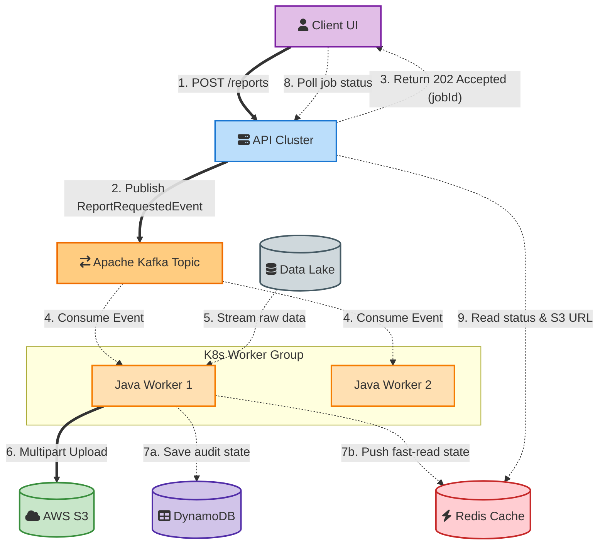

# Asynchronous Report Generation Daemon: 100x Scale Deep Dive

## Context & The Scaling Challenge

**The Original Solution:**
Previously, I used a DB-as-Queue polling pattern (with `SELECT ... FOR UPDATE SKIP LOCKED`) to successfully decouple report generation and stop our web pods from crashing. 

**The 100x Scale Problem:**
As we grew to 500,000+ users generating 10,000 requests/minute (with reports ranging from 5GB to 50GB), the database polling pattern became a massive bottleneck. 
- **Database Contention:** Polling Oracle at this frequency with multiple workers caused severe lock contention and exhausted our database connection pools, starving the core business APIs.
- **Static Scaling:** A fixed set of Java daemons couldn't efficiently handle sudden, massive traffic spikes. 

**My Action/Solution:**
I redesigned the system into a true event-driven architecture using **Apache Kafka** as the message broker, combined with dynamically auto-scaling distributed workers.

---

## System Architecture: Event-Driven Redesign

To handle 100x scale, I completely decoupled the API tier from the compute/worker tier using a distributed log. 

Here is the vertical flow of the new Kafka-based architecture:

---

## Step-by-Step Technical Workflow

### 1. Fast Enqueue (API to Kafka)
Instead of executing an ACID transaction against an Oracle DB, the API validates the payload, generates a unique `jobId`, and asynchronously fires a `ReportRequestedEvent` into a partitioned Kafka topic (e.g., `cloud-cost-reports`). 
- The API instantly returns a `202 Accepted` to the client.
- **Why Kafka?** It handles hundreds of thousands of events per second with sub-millisecond latency. Partitioning the topic allows for massive parallel consumption.

### 2. Distributed Consumption
I set up the distributed worker pods as a Kafka Consumer Group. Kafka natively handles the offset tracking and ensures each job is delivered to exactly one worker pod within the group.

### 3. Processing & Bounded Memory
Similar to my original design, the workers maintain a bounded memory footprint. But at this scale, I pull data from a read-optimized Data Lake rather than a transactional Oracle DB.
- The worker aggregates the data in-memory in small chunks.
- I used the **AWS S3 Multipart Upload API** to stream the output directly to storage. This prevents us from having to hold a 50GB file on the local disk or crashing the JVM heap.

### 4. Status Fast-Reads
Once the report finishes, the worker updates the persistent job state in DynamoDB (for auditing) and pushes the final state (including the S3 presigned URL) to a Redis cache. 
- When the client polls for status, the API queries Redis instead of Oracle, giving sub-millisecond response times and protecting our primary DB from read spam.

### 5. Failure Handling (Zombie Jobs)
If a worker crashes midway, it stops sending heartbeat signals to the Kafka broker. After the session timeout hits, Kafka automatically triggers a rebalance and reassigns that partition (and the failed job) to a healthy worker pod. This guarantees at-least-once processing without needing manual reaper scripts.

---

## Auto-scaling Distributed Workers

A critical piece of this redesign was how I handled scaling. A static number of worker pods would either get crushed during peak hours or waste expensive compute during the night.

**My Solution: Metric-Driven Autoscaling**
I didn't scale based on CPU or Memory (which are terrible, lagging indicators for async queue processing). Instead, I scaled the pods based on **Kafka Topic Lag** (the difference between produced messages and consumed messages).

To achieve this, I combined **HPA (Horizontal Pod Autoscaler)** with **KEDA (Kubernetes Event-driven Autoscaling)**. Here is exactly how they fit together in the architecture:

*   **KEDA (The Metrics Adapter):** Native HPA only understands basic metrics like CPU and memory usage. KEDA bridges this gap by actively tracking the Kafka Topic Lag and feeding that exact number to the HPA.
*   **HPA (The Scaling Engine):** This is the native Kubernetes component that actually adds or removes the worker pods based on the metrics KEDA provides.

This setup allows the system to proactively scale based on the actual backlog of pending reports, rather than waiting for a pod's CPU to spike:

*   **Dynamic Scaling:** As the queue piles up, KEDA signals the HPA, which automatically spins up additional worker pods. 
*   **Scale to Zero:** When traffic dies down, the worker count gracefully scales down, keeping our cloud costs incredibly lean.
*   **Partition Limits:** The max scale is naturally bound by the Kafka topic partitions (e.g., 50 partitions = max 50 active worker pods).

---

## Future Enhancements: Evaluating Apache Spark

While a fleet of Java daemon pods handles high scale beautifully, extreme data volumes (e.g., aggregating terabytes for a single report) push the limits of single-node processing. For future iterations, I evaluated transitioning the worker tier to **Apache Spark**.

### Java Daemon Workers vs. Apache Spark Jobs

| Feature | Java Kafka Workers (Current) | Apache Spark Jobs (Future) |
| :--- | :--- | :--- |
| **Best For** | Row-by-row streaming, I/O bound tasks, generating files up to ~50GB. | Heavy aggregations, complex joins, distributed computation over terabytes of data. |
| **Processing Model** | Single pod processes a single report from start to finish. | A master node distributes the computation for a *single report* across multiple executors. |
| **Operational Overhead** | Low. Fits perfectly into our existing Kubernetes microservices. | High. Requires managing EMR, Databricks, or Spark-on-K8s clusters. |
| **Startup Latency** | Milliseconds (pod is already running and waiting). | Seconds to Minutes (spinning up an ephemeral Spark cluster). |

**My Strategy going forward:** For standard large reports, the auto-scaling Java workers are the best, low-overhead solution. But for massive "whale" reports, the Kafka consumer would act as an orchestrator—it wouldn't process the data itself, but rather submit a job to a Spark cluster and update Redis when Spark finishes.

---

## SDE-2 Interview Strategy & Q&A

### "Why migrate to Kafka if DB Polling worked initially?"

**My Answer:** 
At 10,000 requests/minute, `SELECT ... FOR UPDATE SKIP LOCKED` created massive lock contention and drained our database connection pool. It was starving the core transactional business APIs. Kafka removed this load entirely from the database and gave us a highly scalable, partitioned event stream purpose-built for this exact workload.

### "How do you ensure a crashed worker doesn't result in a lost report?"

**My Answer:** 
I relied on Kafka Consumer Groups and offsets. Workers do not commit the Kafka offset until the report is fully uploaded to S3 and DynamoDB is updated. If a worker crashes, the Kafka broker detects the dead heartbeat (session timeout), triggers a rebalance, and reassigns the uncommitted message to a healthy worker. 

### "How do you handle autoscaling for the background workers?"

**My Answer:** 
I used metric-driven scaling, not resource-driven. Scaling a queue processor based on CPU is ineffective. I configured Kubernetes to scale based on *Kafka Topic Lag*. If the lag spikes, we spin up more pods. The max concurrency is strictly hard-limited by the number of partitions I configured in the Kafka topic.
