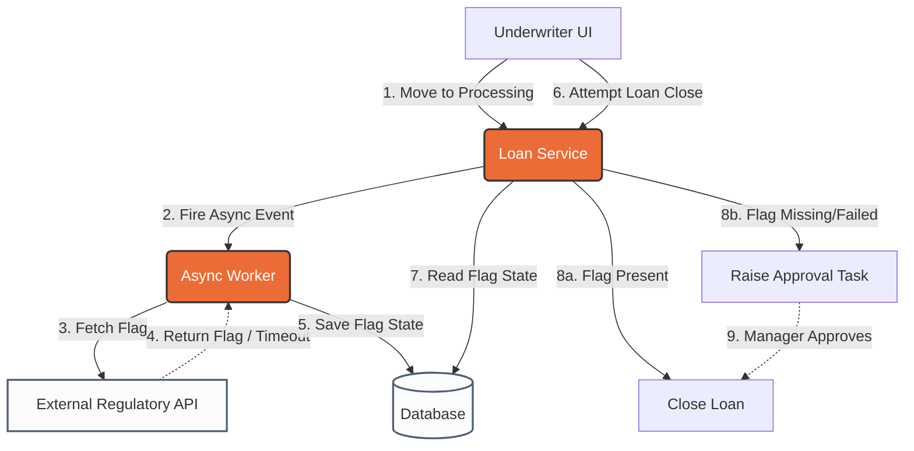

# Volcker 23A Compliance Checks

This document provides an end-to-end understanding of the Volcker 23A Compliance Checks project, tailored specifically for an SDE-2 engineering depth. It comprehensively covers systemic validation, structural designs, and edge-case mitigation required for a robust distributed system. Additionally, it includes realistic interview cross-questions to help you confidently articulate your architectural decisions.

## Table of Contents
*   [STAR & Project Context](#star--project-context)
*   [End-to-End System Architecture](#end-to-end-system-architecture)
*   [HLD (High-Level Design)](#hld-high-level-design)
*   [Deep Dive (Resilience & Scale)](#deep-dive-resilience--scale)
*   [Testing & Validation](#testing--validation)
*   [Question Bank & Strategies](#question-bank--strategies)

## STAR & Project Context
*   **What is Volcker 23A:** A regulatory compliance check that restricts a bank from lending money to clients it advises or manages, avoiding critical conflicts of interest.
*   **Situation:** The Operations team was manually verifying the Volcker check for every loan. This process was extremely slow, highly prone to human error, and carried immense regulatory risk.
*   **Task:** The objective was to replace this manual review with an automated pipeline guaranteeing 100% accuracy, with the main technical challenge being system resilience during inevitable external API outages.
*   **Action:** I designed an event-driven architecture where a loan transitioning to the "processing" state fires an asynchronous event to fetch the Volcker flag. While this happens in the background, underwriters continue their work. If the external API fails, a dual-check fallback system activates at the closing step, allowing a manager to unblock the loan safely.
*   **Result:** This architecture completely eliminated manual errors, achieved 100% regulatory accuracy, and ensured that operations were never hard-blocked by third-party latency or downtime.
*   **Why we did it (Motivation & Trade-offs):** We automated the check to ensure consistency and create a clear audit trail for exceptional cases. The primary trade-off was introducing a strict dependency on an external regulatory API, which we mitigated through async decoupling.
*   **What else we could have done (Alternatives):** We considered capturing and persisting Volcker details in our own database during the initial client onboarding phase. This alternative was discarded because regulatory statuses can change dynamically, and maintaining duplicated internal data risked operating on stale information and violating compliance.

## End-to-End System Architecture

The workflow is decoupled into four logical phases to ensure underwriters are never blocked by synchronous API latency. 

### 1. Trigger (Processing State)
*   **Event/Trigger:** A loan transitions into the "processing" state via the underwriter UI.
*   **Action/Mechanism:** This state change publishes an asynchronous event to the backend message broker to fetch the Volcker flag.
*   **Benefit/Result:** Decouples the UI from the external fetch. Underwriters can immediately proceed with filling out other loan details without waiting for the regulatory check to complete.

### 2. Async External Integration
*   **Event/Trigger:** A background worker or consumer picks up the async event.
*   **Action/Mechanism:** The worker orchestrates an HTTP call to the external regulatory API using the client's identifiers. Upon response, it persists the Volcker flag to the database against the loan record.
*   **Benefit/Result:** Isolates the potentially slow or flaky external API call to a background process, enabling the use of retries and circuit breakers without degrading the user experience.

### 3. Closing Evaluation (Decision Engine)
*   **Event/Trigger:** The underwriter finishes processing and initiates the "loan closing" step via the UI.
*   **Action/Mechanism:** The system synchronously evaluates the pre-fetched Volcker flag from the database. If a valid flag exists, it proceeds. If the flag is missing or null, it strictly blocks standard closing.
*   **Benefit/Result:** Enforces a "Fail-Closed" compliance boundary, guaranteeing 100% regulatory accuracy by preventing unverified loans from proceeding.

### 4. Dual-Check Fallback Workflow
*   **Event/Trigger:** The closing evaluation fails because the async fetch was unsuccessful (e.g., external API outage).
*   **Action/Mechanism:** The UI allows the underwriter to raise an "approval task." A manager manually reviews this task and approves it, generating an auditable database record (`loanId`, `approverId`, `timestamp`, `justification`).
*   **Benefit/Result:** Ensures business operations do not grind to a halt during external vendor outages, maintaining flow via authorized, highly traceable manual overrides.

## HLD (High-Level Design)

## Deep Dive (Resilience & Scale)

### Asynchronous Decoupling & Circuit Breaking
Relying on a synchronous external API during the closing step creates a severe single point of failure. By utilizing an **Event-Driven Design**, the Volcker check is isolated from the critical path. The async worker's call to the external API is wrapped in a **Resilience4j circuit breaker**. If the external API degrades, the circuit trips open, failing the background task gracefully rather than tying up threads or crashing the system. Crucially, the system utilizes the **Fail-Closed Principle** at the closing step—if no flag was fetched, it assumes the loan cannot proceed automatically, leaning on the managerial dual-check to safely unblock operations.

### Idempotency in Distributed Events
In event-driven architectures, network drops and duplicated message deliveries are common. The async workers are built as **Idempotent Consumers**. They utilize a unique hash (e.g., `loanId_fetch_attempt`) verified against a distributed cache (like Redis) or a database constraint. If an event is processed twice, the second attempt is safely discarded to prevent redundant downstream API calls. Similarly, if an underwriter repeatedly clicks "Raise Approval Task" during a UI lag, an **Idempotency Key** ensures only one manager task is generated.

### Optimistic Concurrency Control (OCC)
In a high-throughput operations environment, an underwriter might update loan details at the exact same moment a manager is reviewing the approval task. We manage this via **Optimistic Locking** (using the `@Version` annotation in Spring Boot / Hibernate). When a manager approves a task, the query runs: `UPDATE loan SET status='CLOSED', version=3 WHERE id=123 AND version=2`. If an underwriter had just updated a field (bumping the version to 3), the manager's update throws an `OptimisticLockException`. This prevents corrupted data states and race conditions without the heavy performance overhead of pessimistic row locking.

## Testing & Validation 

1. **Unit & Integration Testing:** 
   We heavily utilized WireMock to mock the external regulatory APIs, simulating both successful flag returns and timeout failures. We also wrote integration tests to verify that the loan closing step correctly intercepts missing flags and strictly routes the user to the approval task flow.
2. **Resilience Testing:** 
   To validate our circuit breakers and fallback flows, we intentionally injected `HTTP 500` errors and artificial latency via WireMock to force the async worker to fail. We verified that the primary system did not crash, threads were not exhausted, and the fallback dual-check UI activated seamlessly.
3. **Concurrency Testing:** 
   We simulated parallel thread requests against the manager approval and loan update endpoints. This validated that our Optimistic Locking implementation successfully caught state conflicts and threw the expected exceptions instead of allowing dirty writes.

## Question Bank & Strategies

### 1. "How do you handle latency or outages in the external regulatory API?"
*   **Strategy:** Emphasize decoupling the critical path from the external dependency, followed by detailing your resilient fallback strategy.
*   **Sample Answer:** "I decoupled the external dependency by moving it to an asynchronous event. When a loan enters the processing state, we fire a background event to fetch the Volcker flag. This allows underwriters to continue their work without waiting. If the external API experiences an outage, the fetch fails gracefully. When the underwriter eventually reaches the closing step, the system detects the missing flag and fails-closed for compliance, prompting them to raise a manual approval task. This ensures 100% regulatory accuracy without completely blocking business operations."

### 2. "How do you guarantee idempotency in this workflow?"
*   **Strategy:** Highlight your understanding of distributed systems by explaining how you handle duplicate network events and client retries safely.
*   **Sample Answer:** "Idempotency is enforced in two specific places. First, the async worker that consumes the fetch event uses a distributed cache to check for duplicate event IDs, preventing us from spamming the external regulatory API on a retry. Second, if the API is down and the underwriter raises a manager approval task, the UI sends an Idempotency Key constructed from the `loanId` and a version hash. If they double-click or the network drops during the request, the backend safely returns the existing task rather than creating duplicate records."

### 3. "Explain the locking mechanism when multiple users act on the same loan simultaneously."
*   **Strategy:** Detail your use of Optimistic Locking (OCC) to prevent race conditions during state transitions without degrading system performance.
*   **Sample Answer:** "We rely on Optimistic Concurrency Control using a version column in the database via Hibernate. Since the Volcker flag fetch is async, and the manager approval happens in parallel with potential underwriter edits, state conflicts are a real risk. If a manager approves the fallback task while an underwriter is modifying the loan amount, the manager's transaction will detect a version mismatch during the `UPDATE`. It throws an `OptimisticLockException`, failing safely and prompting a UI refresh, which avoids the heavy performance hit of pessimistic row locking."

### 4. "What were the trade-offs of relying on an external API versus storing this data internally?"
*   **Strategy:** Show the interviewer that you evaluate architectural trade-offs, specifically balancing data consistency against system coupling.
*   **Sample Answer:** "The main trade-off was between external dependency and data duplication. We considered capturing Volcker details during the initial client onboarding phase, which would eliminate the external API call and vastly improve latency. However, regulatory statuses can change dynamically. Duplicating this data internally risked operating on stale information, which is a massive compliance risk. We chose strict consistency by relying on the external API for real-time checks, and mitigated the resulting latency and availability risks by utilizing async events and a robust fallback workflow."

### 5. "How does the system ensure the fallback mechanism doesn't become a loophole for non-compliance?"
*   **Strategy:** Demonstrate your understanding of system auditing, security, and business process safeguards in fail-closed scenarios.
*   **Sample Answer:** "Because the system operates on a strict 'fail-closed' principle, an underwriter cannot bypass a missing flag on their own. The fallback requires a distinct authorization level—a manager must review and approve the task. Architecturally, when this happens, the system generates a tamper-proof audit trail capturing the `loanId`, `approverId`, exact `timestamp`, and the `justification`. This guarantees that even during degraded API states, every single bypass is explicitly authorized and fully traceable for regulatory audits."
