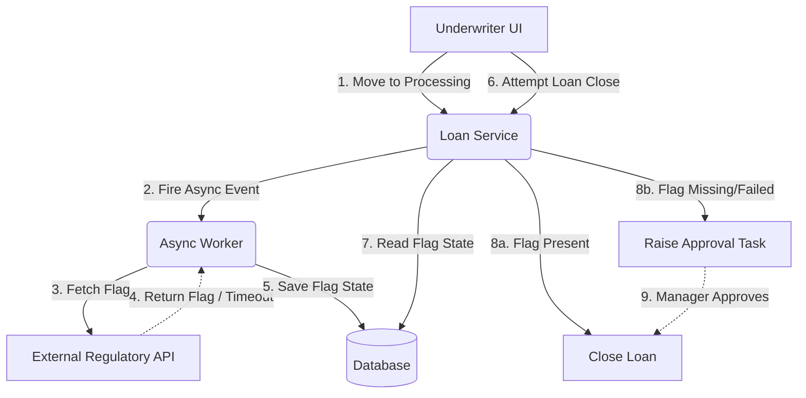

# Volcker 23A Compliance Checks - Architecture Deep Dive

This document serves as an end-to-end understanding of the Volcker 23A Compliance Checks project. It is specifically tailored for an SDE-2 (mid-level) depth, covering the systemic validation pipeline, structural designs, edge-case mitigation, and common deep-dive cross-questions you may face during an engineering interview.

## Table of Contents

1. [Project Overview](#project-overview)
2. [End-to-End System Architecture](#end-to-end-system-architecture)
3. [Component Flow Diagram](#component-flow-diagram)
4. [SDE-2 Technical Deep Dive (Resilience & Scale)](#sde-2-technical-deep-dive-resilience--scale)
5. [Testing & Validation Strategies](#testing--validation-strategies)
6. [SDE-2 Interview Question Bank & Strategies](#sde-2-interview-question-bank--strategies)

---

## Project Overview

**What is Volcker Check:** Volcker restricts a bank to lend money to clients it advises or manages avoiding any conflict of interest.

**Situation:** The Operations team was manually verifying Volcker check for each loan. This process was slow, highly prone to human error, and carried immense regulatory risk.

**Task:** I had to replace this manual review with an automated pipeline to guarantee 100% accuracy. The challenge was ensuring the system stayed resilient during external outages.

**Action:** I built a system where, when a loan moves to the processing state, it fires an async event to fetch the Volcker flag. During this period, the underwriters simply fill out other necessary details. By the time they reach the loan closing step, the flag is successfully updated. If there are any failures due to which no flag was fetched a dual-check system allows the underwriter to raise an approval task which the manager approves to close the loan, ensuring operations are not blocked.

**Result:** Through this flow I eliminated manual errors and achieved 100% regulatory accuracy.

---

## End-to-End System Architecture

The workflow is decoupled to ensure the underwriters are never blocked by synchronous API latency, broken into four phases: Trigger, Async Integration, Closing Evaluation, and the Dual-Check Fallback.

### 1. Trigger (Processing State)

- **Event:** A loan transitions into the "processing" state via the UI.
- **Action:** This transition fires an **asynchronous event** to the backend, instructing the system to fetch the Volcker flag in the background.
- **Benefit:** Underwriters immediately continue filling out other necessary loan details without waiting for the regulatory check to complete.

### 2. Async External Integration

- **Mechanism:** An event consumer or background worker orchestrates a call to the external regulatory API.
- **Payload:** It sends the required client identifiers.
- **Result:** The regulatory API evaluates the client and returns the Volcker flag, which is then persisted to the database against the loan record.

### 3. Closing Evaluation (Decision Engine)

By the time the underwriter finishes processing and initiates the **loan closing step**, the system evaluates the pre-fetched flag:

- **Valid Flag Found:** The loan clears the check and proceeds seamlessly to closing.
- **Flag Missing (API Failure):** The system prevents a standard close to maintain 100% regulatory accuracy, triggering the fallback workflow.

### 4. Dual-Check Fallback Workflow

External outages are inevitable, but operations cannot grind to a halt.

- **Creation:** If the async fetch failed (leaving the flag null), the system blocks the immediate close and allows the underwriter to raise an "approval task."
- **Approval:** A manager reviews the raised task, performing a manual dual-check.
- **Resolution:** The manager approves the task, safely unblocking the loan for closing and creating an auditable database record (`loanId`, `approverId`, `timestamp`, `justification`).

---

## Component Flow Diagram

Below is the structural diagram demonstrating the asynchronous event flow and fallback mechanism:

---

## SDE-2 Technical Deep Dive (Resilience & Scale)

### Asynchronous Decoupling & Circuit Breaking

Relying on a synchronous external API during the closing step creates a single point of failure.

- **Event-Driven Design:** Moving the fetch to the "processing" state isolates external API latency from the critical path.
- **Resilience4j Integration:** The async worker's call to the external API is wrapped in a Resilience4j circuit breaker. If the external API degrades, the circuit trips open, failing the background task gracefully rather than crashing the system.
- **Fail-Closed Principle:** If the flag isn't fetched, the system defaults to "Fail-Closed" at the closing step. It assumes the loan cannot proceed automatically, guaranteeing zero regulatory violations while leaning on the managerial dual-check to unblock operations.

### Idempotency in Distributed Events

Network drops or duplicated message deliveries occur frequently in event-driven architectures.

- **Idempotent Consumers:** The async worker processing the flag-fetch event must be idempotent. It uses a unique hash (e.g., `loanId_fetch_attempt`) verified against a database constraint or distributed cache (Redis). If the event is processed twice, the second attempt is discarded, preventing redundant downstream API calls.
- **Task Creation:** Similarly, if an underwriter repeatedly clicks "Raise Approval Task" during a UI lag, an Idempotency Key ensures only one manager task is generated.

### Optimistic Concurrency Control (OCC)

In a high-throughput Ops environment, an underwriter might update loan details while a manager is simultaneously reviewing the approval task.

- **Mechanism:** Implemented via Optimistic Locking (`@Version` annotation in Spring Boot / Hibernate).
- **Execution:** When the manager approves the task, the query reads: `UPDATE loan SET status='CLOSED', version=3 WHERE id=123 AND version=2`. If the underwriter just updated a field (bumping the version to 3), the manager's update throws an `OptimisticLockException`, preventing corrupted states and race conditions.

---

## Testing & Validation Strategies

1. **Unit & Integration Testing:**
   - Mocked external APIs using WireMock to simulate successful flag returns and timeout failures.
   - Verified that the loan closing step correctly intercepts missing flags and routes to the approval task flow.
2. **Resilience Testing (Simulated Outages):**
   - Intentionally injected `HTTP 500` errors and latency via WireMock to force the async worker to fail.
   - Confirmed that operations were not hard-blocked and the fallback dual-check system activated properly.
3. **Concurrency Testing:**
   - Simulated parallel thread requests on the manager approval endpoint to validate that Optimistic Locking caught state conflicts.

---

## SDE-2 Interview Question Bank & Strategies

### 1. "How do you handle latency or outages in the external regulatory API?"

**Strategy:** Emphasize decoupling the critical path from the external dependency, followed by your fallback strategy.
**Sample Answer:** "I decoupled the external dependency by moving it to an asynchronous event. When a loan enters the processing state, we fire a background event to fetch the Volcker flag. This allows underwriters to continue their work without waiting. If the external API experiences an outage, the fetch fails gracefully. When the underwriter eventually reaches the closing step, the system detects the missing flag and fails-closed for compliance, prompting them to raise a manual approval task. This ensures 100% regulatory accuracy without completely blocking business operations."

### 2. "How do you guarantee idempotency in this workflow?"

**Strategy:** Explain your handling of duplicate events and client retries.
**Sample Answer:** "Idempotency is enforced in two places. First, the async worker that consumes the fetch event uses a distributed cache to check for duplicate event IDs, preventing us from spamming the external regulatory API. Second, if the API is down and the underwriter raises a manager approval task, the UI sends an Idempotency Key constructed from the `loanId` and a version hash. If they double-click or the network drops during the request, the backend safely returns the existing task rather than creating duplicates."

### 3. "Explain the locking mechanism when multiple users act on the same loan simultaneously."

**Strategy:** Detail your use of Optimistic Locking to prevent race conditions during state transitions.
**Sample Answer:** "We rely on Optimistic Concurrency Control using a version column in the database via Hibernate. Since the Volcker flag fetch is async, and the manager approval happens in parallel with potential underwriter edits, state conflicts are a real risk. If a manager approves the fallback task while an underwriter is modifying the loan amount, the manager's transaction will detect a version mismatch during the `UPDATE`. It throws an `OptimisticLockException`, failing safely and prompting a refresh, which avoids the heavy performance hit of pessimistic row locking."
