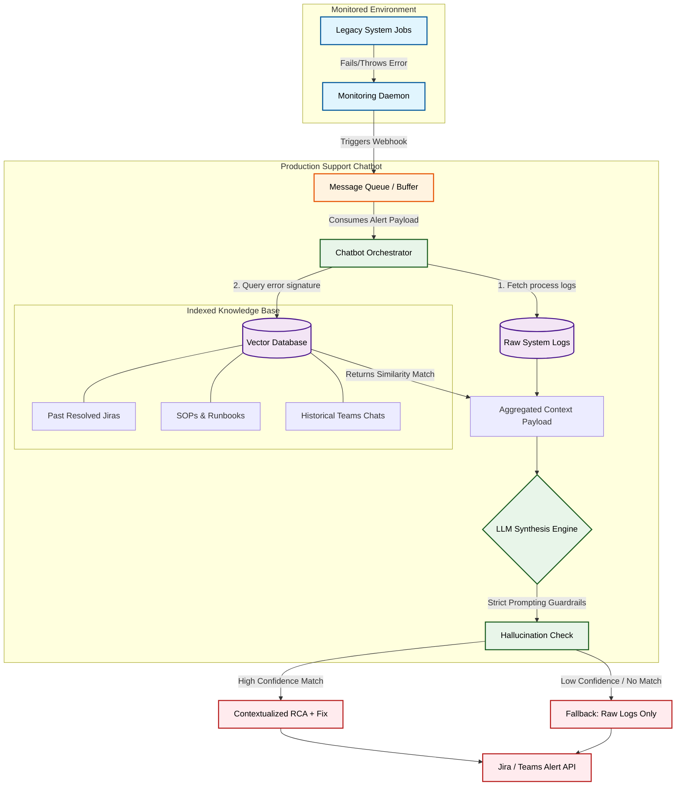

# Production Support Agent
This document provides an end-to-end understanding of the Production Support Agent project, tailored for an SDE-2 interview depth. It thoroughly covers systemic validation, structural system designs, and edge-case mitigation strategies. Additionally, it includes targeted interview cross-questions and answers to ensure complete preparedness for deep-dive architectural discussions.

## Table of Contents
* [STAR & Project Context](#star--project-context)
* [End-to-End System Architecture](#end-to-end-system-architecture)
* [HLD (High-Level Design)](#hld-high-level-design)
* [Deep Dive (Resilience & Scale)](#deep-dive-resilience--scale)
* [Testing & Validation](#testing--validation)
* [Question Bank & Strategies](#question-bank--strategies)

## STAR & Project Context
* **What is Production Support Agent:** An automated, event-driven AI chatbot designed to accelerate incident response by instantly correlating active production failures with historical fixes and system runbooks.
* **Situation:** Legacy systems in our organization had a steep learning curve. On-call engineers were wasting hours digging through past Jiras, static runbooks, and historical Teams chats just to gather context on recurring production failures, leading to high Mean Time to Resolution (MTTR).
* **Task:** The objective was to eliminate manual toil and drastically reduce the time from alert to investigation by automating the context-gathering and initial diagnostic phase.
* **Action:** I architected and built an event-driven chatbot that intercepts failure webhooks via a message queue. It gathers system logs and queries a vector database (pre-indexed with past Jiras and runbooks) to provide Retrieval-Augmented Generation (RAG) context to an LLM. The LLM then synthesizes a highly contextualized Root Cause Analysis (RCA).
* **Result:** This automation significantly cut down the TTR for the entire production support team by eliminating the need to investigate recurring, known issues from scratch. Engineers now receive alerts with historical fixes already attached.
* **Why we did it (Motivation & Trade-offs):** We chose an asynchronous, queue-based RAG architecture over a synchronous API design to guarantee we never block or impact the underlying monitored legacy systems. We accepted the trade-off of a slight processing delay (seconds for LLM generation) in exchange for highly accurate, actionable RCA outputs.
* **What else we could have done (Alternatives):** We considered relying entirely on standard log-based alerting (e.g., Elasticsearch/Kibana watch rules) with static links to runbooks. This was discarded because it still required the on-call engineer to manually read the runbook, mentally correlate it to the specific stack trace, and search for edge cases, missing the synthesis value that an LLM provides.

## End-to-End System Architecture

* **Phase 1: Alert Trigger & Ingestion**
  * **Event/Trigger:** A process monitoring daemon (e.g., Procmon) detects a failure, error thrown, or threshold breach in the legacy app.
  * **Action/Mechanism:** The monitor fires a webhook payload into a central Message Queue (MQ) buffer, decoupling the alerting mechanism from the chatbot processor.
  * **Benefit/Result:** Provides fault tolerance. If the chatbot goes down or the LLM API is rate-limited, alerts queue up safely without crashing the legacy system's monitoring daemon.

* **Phase 2: Context Aggregation (RAG)**
  * **Event/Trigger:** The Chatbot Orchestrator consumes the alert payload from the message queue.
  * **Action/Mechanism:** The orchestrator concurrently fetches raw system logs and embeddings of the error signature to query the Vector DB (using K-Nearest Neighbors). This retrieves relevant chunks of past resolved Jiras, SOPs, and Teams chats.
  * **Benefit/Result:** Replaces slow, manual string matching with high-speed semantic search, providing the LLM with exact, factual historical data for the specific error.

* **Phase 3: Synthesis & Evaluation**
  * **Event/Trigger:** Aggregated raw logs and vector search results are packaged into a prompt.
  * **Action/Mechanism:** The payload is sent to the LLM Synthesis Engine with strict prompting guardrails that force the model to answer *only* using the provided context. A Hallucination Check evaluates the confidence and relevance of the match.
  * **Benefit/Result:** Automates the cognitive heavy lifting of correlating a fresh stack trace to a historical runbook step.

* **Phase 4: Fallback & Notification**
  * **Event/Trigger:** The hallucination guardrail returns a pass (High Confidence) or fail (Low Confidence/No Match).
  * **Action/Mechanism:** On high confidence, it pushes a highly contextualized RCA with historical fixes to the Jira/Teams API. On low confidence, a fail-safe triggers, pushing *only* the raw logs.
  * **Benefit/Result:** Ensures zero hallucination in a critical production environment. Engineers are never misled by an AI guessing an incorrect fix.

## HLD (High-Level Design)

## Deep Dive (Resilience & Scale)

### Asynchronous Decoupling & Backpressure (Fail-Safe Mechanism)
To prevent the monitoring daemon from impacting the host application, the entire ingestion pipeline is decoupled using a Message Broker (like RabbitMQ or Kafka). If the downstream LLM API experiences rate limiting or an outage, the messages simply buffer in the queue. We implemented a robust backpressure mechanism so that the Chatbot Orchestrator only pulls messages it has the compute capacity to process, guaranteeing system stability during alert storms.

### Idempotency & Alert Debouncing
Production systems often experience cascading failures, resulting in hundreds of identical alerts firing per minute. To avoid rate-limiting our LLM and spamming the engineering team, the Chatbot Orchestrator implements idempotency. We generate a SHA-256 hash based on the error signature and the originating service. Using a distributed cache (like Redis), we set a TTL (e.g., 15 minutes). If the same hash arrives within the TTL, the event is acknowledged in the queue and dropped, preventing duplicate RCA generation.

### Graceful Degradation & Hallucination Guardrails
In incident response, a wrong answer is worse than no answer. The system is designed to "fail open" to human intervention. We implemented strict confidence thresholds on the Vector DB similarity search (e.g., cosine similarity > 0.85). If the retrieved context falls below this threshold, the system gracefully degrades: it completely bypasses the LLM synthesis and ships the raw logs directly to the Teams API. This ensures the system acts as a standard alerting pipeline when it encounters novel issues.

## Testing & Validation 

1. **Unit & Integration Testing:** We utilized WireMock to simulate external dependencies like the Jira API, Teams webhook, and the LLM API. This allowed us to validate the Chatbot Orchestrator's internal logic, prompting construction, and JSON parsing without incurring API costs.
2. **Resilience Testing:** We intentionally injected faults into our staging environment to test fail-safes. We simulated 500/503 HTTP errors from the LLM endpoint to ensure the system fell back to raw logs, and we crashed the Chatbot orchestrator to verify that the Message Queue retained alert payloads without data loss.
3. **Concurrency & Load Testing:** We used load-testing tools (like JMeter/Locust) to blast the webhook endpoint with 1,000+ simultaneous alerts. This validated our Redis-based deduplication/idempotency logic (ensuring no race conditions occurred when setting the cache lock) and confirmed that our message queue successfully throttled the consumption rate to stay within our LLM API limits.

## Question Bank & Strategies

### 1. "How do you prevent the LLM from hallucinating incorrect remediation steps?"
* **Strategy:** Highlight strict RAG guardrails, prompting techniques, and confidence thresholds.
* **Sample Answer:** "We rely on a strict Retrieval-Augmented Generation pipeline. I designed the system so the LLM is prompted to only use the retrieved runbooks and past Jira resolutions, explicitly instructing it to never rely on its internal memory. If the similarity search score from the Vector DB is too low—meaning we haven't seen this exact issue before—the system gracefully degrades. It safely defaults to providing the raw aggregated logs to the engineers without attempting to guess a fix."

### 2. "How does the bot gather context efficiently during an active incident?"
* **Strategy:** Focus on pre-indexing and fast retrieval mechanisms over manual or real-time brute-force searching.
* **Sample Answer:** "Knowing that manual string matching across logs and old Jiras is far too slow during an outage, I implemented a pre-indexing strategy. We chunk and embed historical Jiras, Teams discussions, and SOPs into a vector database asynchronously. When an alert fires, the bot instantly embeds the error signature and executes a highly optimized K-Nearest Neighbors search. This allows the system to pull up the exact historical fix with sub-second latency."

### 3. "What happens if the webhook fails or the chatbot itself goes down?"
* **Strategy:** Demonstrate an understanding of fault tolerance, system decoupling, and buffering.
* **Sample Answer:** "I decoupled the chatbot from the actual legacy monitoring systems using a message queue buffer. If the bot goes down or if our LLM provider has an outage, the webhook payloads simply queue up safely in the broker. Crucially, the monitoring agent itself isn't blocked by synchronous API timeouts, ensuring we don't accidentally impact the performance of the host application we are trying to monitor."

### 4. "How did you measure the reduction in Time to Resolution (TTR)?"
* **Strategy:** Focus on defining metrics logically and eliminating the manual 'hunting and gathering' phase.
* **Sample Answer:** "Before rolling out the bot, we baselined the manual process: calculating the average time it took an engineer to acknowledge an alert, log into the server, pull logs, and search Jira history. After deployment, we tracked the time from alert generation to the first active remediation step. By attaching the logs and historical fixes directly to the alert payload, that entire context-gathering phase was eliminated, which drastically cut down the initial investigation time."

### 5. "Production errors often cascade. How did you handle 'alert storms' to prevent overwhelming the LLM and the engineers?"
* **Strategy:** Explain deduplication, idempotency keys, and distributed caching to prevent system flooding.
* **Sample Answer:** "During early testing, a single database connection drop triggered hundreds of identical alerts in seconds, threatening to rate-limit our LLM. I solved this by implementing an idempotency layer using Redis. When an alert is ingested, the orchestrator generates a SHA-256 hash of the error signature and service name. If that hash already exists in Redis within a 15-minute TTL, we simply acknowledge and drop the duplicate message in the queue, completely protecting our downstream LLM and keeping the Teams channel noise-free."
