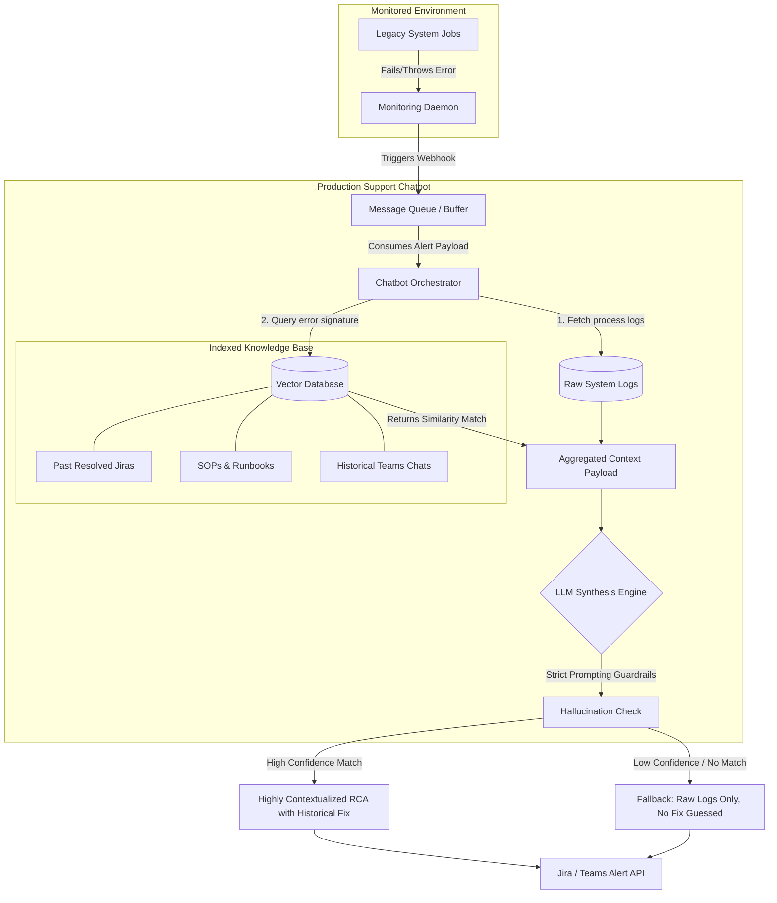

# Production Support Agent

## Table of Contents

1. [Project Overview](#project-overview)
2. [Why We Built It](#why-we-built-it)
3. [Architecture and End-to-End Flow](#architecture-and-end-to-end-flow)
4. [Technical Deep Dive](#technical-deep-dive)
5. [SDE-2 Interview Preparation: Deep Dive Questions](#sde-2-interview-preparation-deep-dive-questions)

---

## Project Overview

**Situation:** Legacy systems have a steep learning curve, causing on-call engineers to waste alot of time going through past Jiras, runbooks, and Teams chats just to gather context on recurring production failures.

**Task:** This is something I faced when I joined here so I wanted to reduce the time from alert to investigation by automating the manual context-gathering.

**Action:** I built a chatbot that when provided with failures, gathers context about failure via system logs, runbooks and past Jiras, and automatically generates a highly contextualised RCA with historical fixes.

**Result:** The automation helped entire team in production support, significantly cutting down Time to Resolution by eliminating the need to investigate recurring issues from scratch.

---

## Why We Built It

Legacy systems have a steep learning curve. When I first joined, I noticed on-call engineers were wasting hours digging through past Jiras, runbooks, and Teams chats just to gather context on recurring production failures. I wanted to eliminate this manual toil and reduce the time from alert to investigation. By automating the context-gathering process and generating an initial diagnosis based on historical fixes, this chatbot significantly cut down the Time to Resolution for the entire production support team by eliminating the need to investigate recurring issues from scratch.

---

## Architecture and End-to-End Flow

Below is the detailed architectural flow of how the chatbot intercepts failures, gathers context, and generates the RCA.

1. **Trigger and Orchestration:**
   - The system relies on process monitoring daemons (e.g., Procmon).
   - When a failure or threshold breach is detected, it triggers a webhook alert that queues into a message broker, initializing the chatbot.

2. **Context Aggregation:**
   - The bot immediately pulls the specific system logs related to the failure.
   - It queries the Vector Database, scraping past Jira tickets, Teams chats, and standard runbooks to find out how similar issues were handled previously.

3. **Synthesis and RCA Generation:**
   - An LLM processes the aggregated logs alongside the historical fixes and runbook steps.
   - It synthesizes this into a highly contextualized Root Cause Analysis (RCA) containing actionable historical fixes, pushing it directly to the team so they don't have to start from scratch.

---

## Technical Deep Dive

### Retrieving Historical Context (RAG)
To make the chatbot fast and accurate during an active incident, historical data must be pre-indexed. Standard operating procedures, resolved Jira tickets, and runbooks are chunked, embedded, and stored in a vector database. When a failure occurs, the bot takes the error signature from the system logs and performs a similarity search to pull the exact historical fixes that worked previously. 

### Precision and Hallucination Prevention
In a production support environment, a hallucinated remediation step wastes time. The system uses strict prompting guardrails to enforce that the LLM must *only* use the retrieved context from past Jiras and runbooks. If the similarity search doesn't find a highly confident match for a past issue, the bot defaults to just providing the raw logs without guessing a fix, ensuring engineers are never misled.

---

## SDE-2 Interview Preparation: Deep Dive Questions

### 1. "How do you prevent the LLM from hallucinating incorrect remediation steps?"
**Strategy:** Highlight strict RAG guardrails and confidence thresholds.

**Answer:** 
"We rely on a strict Retrieval-Augmented Generation pipeline. The LLM is prompted to only use the retrieved runbooks and past Jira resolutions, never its internal memory. If the similarity search score for past issues is too low—meaning we haven't seen this exact issue before—the bot safely defaults to just providing the raw aggregated logs without trying to guess a fix."

### 2. "How does the bot gather context efficiently during an active incident?"
**Strategy:** Focus on pre-indexing and fast retrieval over manual searching.

**Answer:** 
"Manual string matching across logs and old Jiras is too slow. Instead, we pre-index historical Jiras, Teams discussions, and SOPs into a vector database. When an alert fires, the bot takes the error signature, embeds it, and does a quick K-Nearest Neighbors search. This allows it to almost instantly pull up how we fixed that exact issue in the past."

### 3. "What happens if the webhook fails or the chatbot itself goes down?"
**Strategy:** Show basic fault tolerance and system decoupling.

**Answer:** 
"We decoupled the chatbot from the actual monitoring systems using a message queue buffer. If the bot goes down, the webhook payloads just queue up safely until it recovers. The monitoring agent itself isn't blocked, ensuring we don't accidentally impact the host application while trying to monitor it."

### 4. "How did you measure the reduction in Time to Resolution?"
**Strategy:** Focus on eliminating the manual "hunting and gathering" phase.

**Answer:** 
"We baselined the manual process—how long it historically took an engineer to get an alert, log into the server, check logs, and search old Jiras. After deploying the bot, that entire context-gathering phase was eliminated. The engineer receives the alert with the logs, runbook, and historical fix already attached, which drastically cuts down the time spent investigating from scratch."
