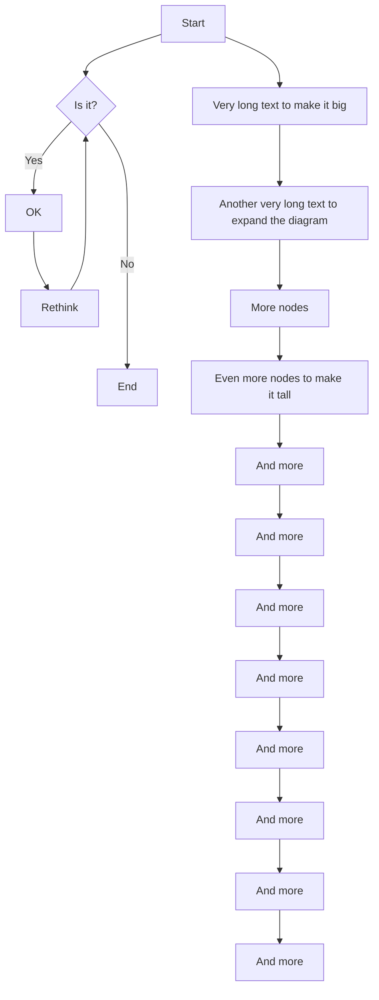

# Test Mermaid

```mermaid
graph TD;
    A[Start] --> B{Is it?};
    B -- Yes --> C[OK];
    C --> D[Rethink];
    D --> B;
    B -- No ----> E[End];
    A --> F[Very long text to make it big];
    F --> G[Another very long text to expand the diagram];
    G --> H[More nodes];
    H --> I[Even more nodes to make it tall];
    I --> J[And more];
    J --> K[And more];
    K --> L[And more];
    L --> M[And more];
    M --> N[And more];
    N --> O[And more];
    O --> P[And more];
    P --> Q[And more];
```
